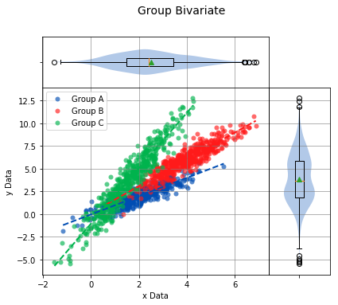
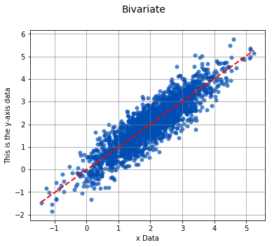

# Bivariate

A [bivariate analysis](https://en.wikipedia.org/wiki/Bivariate_data) differs from a univariate, or distribution analysis, in that it is the analysis of two separate sets of data. These two sets of data are compared to one another to check for [correlation](https://en.wikipedia.org/wiki/Correlation_and_dependence), or a tendency of one of the sets of data to "predict" corresponding values in the other data set. If a linear or higher order model can be applied to describe, or model, the two sets of data, they are said to be correlated.

When two distributions are correlated, it is possible that the data in one of the distributions can be used to predict a corresponding value in the second distribution. This first distribution is referred to as the predictor and the second distribution as the response. Both predictor and response are graphed by a scatter plot, typically with the predictor on the x-axis and the response on the y-axis.

.. note:: Just because two sets of data correlate with one another does not necessarily mean that one predicts the other. It merely means it's a possibility that one predicts the other. This is summarized by the saying "Correlation does not imply causation." Use caution when drawing conclusions of a bivariate analysis. It is a good idea to study both data sets more carefully to determine if the two data sets are in fact correlated.

## Interpreting the Graphs

Let's first import sci-analysis and setup some variables to use in these examples.


```python
import numpy as np
import scipy.stats as st
from sci_analysis import analyze

%matplotlib inline
```


```python
# Create x-sequence and y-sequence from random variables.
np.random.seed(987654321)
x_sequence = st.norm.rvs(2, size=2000)
y_sequence = np.array([x + st.norm.rvs(0, 0.5, size=1) for x in x_sequence])
```

### Scatter Plot

A scatter plot is used in sci-analysis to visualize the correlation between two sets of data. For this to work, each value in the first set of data has a corresponding value in the second set of data. The two values are tied together by the matching index value in each set of data. The length of each set of data have to be equal to one another, and the index values of each data set have to contiguous. If there is a missing value or values in one data set, the matching value at the same index in the other data set will be dropped.

By default, the best-fit line (assuming a linear relationship) is drawn as a dotted red line.


```python
analyze(x_sequence, y_sequence)
```


    
    
    Linear Regression
    -----------------
    
    n         =  2000
    Slope     =  1.0059
    Intercept = -0.0133
    r         =  0.8974
    r^2       =  0.8054
    Std Err   =  0.0111
    p value   =  0.0000
    
    
    
    Pearson Correlation Coefficient
    -------------------------------
    
    alpha   =  0.0500
    r value =  0.8974
    p value =  0.0000
    
    HA: There is a significant relationship between predictor and response
    


### Boxplot Borders

Boxplots can be displayed along-side the x and y axis of the scatter plot. This is a useful tool for visualizing the distribution of the sets of data on the x and y axis while still displaying the scatter plot.


```python
analyze(x_sequence, y_sequence, boxplot_borders=True)
```


    
    
    Linear Regression
    -----------------
    
    n         =  2000
    Slope     =  1.0059
    Intercept = -0.0133
    r         =  0.8974
    r^2       =  0.8054
    Std Err   =  0.0111
    p value   =  0.0000
    
    
    
    Pearson Correlation Coefficient
    -------------------------------
    
    alpha   =  0.0500
    r value =  0.8974
    p value =  0.0000
    
    HA: There is a significant relationship between predictor and response
    


### Contours

In certain cases, such as when one of the sets of data is [discrete and the other is continuous](https://en.wikipedia.org/wiki/Continuous_or_discrete_variable), it might be difficult to determine where the data points are centered. In this case, density contours can be used to help visualize the [join probability distribution](https://en.wikipedia.org/wiki/Joint_probability_distribution) between the two sets of data.


```python
x_continuous = st.weibull_max.rvs(2.7, size=2000)
y_discrete = st.geom.rvs(0.5, loc=0, size=2000)
analyze(x_continuous, y_discrete, contours=True, fit=False)
```


    
    
    Linear Regression
    -----------------
    
    n         =  2000
    Slope     =  0.0209
    Intercept =  2.0554
    r         =  0.0048
    r^2       =  0.0000
    Std Err   =  0.0964
    p value   =  0.8285
    
    
    
    Spearman Correlation Coefficient
    --------------------------------
    
    alpha   =  0.0500
    r value =  0.0019
    p value =  0.9320
    
    H0: There is no significant relationship between predictor and response
    


### Grouped Scatter Plot

If each set of data contains discrete and equivalent groups, the scatter plot can show each group in a separate color.


```python
# Create new x-grouped and y-grouped from independent groups A, B, and C.
a_x = st.norm.rvs(2, size=500)
a_y = np.array([x + st.norm.rvs(0, 0.5, size=1) for x in a_x])

b_x = st.norm.rvs(4, size=500)
b_y = np.array([1.5 * x + st.norm.rvs(0, 0.65, size=1) for x in b_x])

c_x = st.norm.rvs(1.5, size=500)
c_y = np.array([3 * x + st.norm.rvs(0, 0.95, size=1) - 1 for x in c_x])

x_grouped = np.concatenate((a_x, b_x, c_x))
y_grouped = np.concatenate((a_y, b_y, c_y))

grps = np.concatenate((['Group A'] * 500, ['Group B'] * 500, ['Group C'] * 500))
```


```python
analyze(
    x_grouped, 
    y_grouped, 
    groups=grps,
    boxplot_borders=False,
)
```


    
    
    Linear Regression
    -----------------
    
    n             Slope         Intercept     r^2           Std Err       p value       Group         
    --------------------------------------------------------------------------------------------------
    500            1.0349       -0.0855        0.8042        0.0229        0.0000       Group A       
    500            1.4852        0.0162        0.8612        0.0267        0.0000       Group B       
    500            3.0115       -0.9385        0.9135        0.0415        0.0000       Group C       
    
    
    Pearson Correlation Coefficient
    -------------------------------
    
    n             r value       p value       Group         
    --------------------------------------------------------
    500            0.8968        0.0000       Group A       
    500            0.9280        0.0000       Group B       
    500            0.9558        0.0000       Group C       


## Interpreting the Statistics

### Linear Regression

The [Linear Regression](https://docs.scipy.org/doc/scipy/reference/generated/scipy.stats.linregress.html#scipy.stats.linregress) finds the least-squares best-fit line between the predictor and response. The linear relationship between the predictor and response is described by the relationship *y = mx + b*, where *x* is the predictor, *y* is the response, *m* is the slope, and *b* is the y-intercept.

* **n** - The number of data points in the analysis.
* **Slope** - The slope of the best-fit line between predictor and response.
* **Intercept** - The y-intercept of the best-fit line between predictor and response.
* **r** - The [correlation coefficient](https://www.statisticshowto.datasciencecentral.com/probability-and-statistics/correlation-coefficient-formula/) of the linear regression.
* **r^2** - The amount of error that can be described by the linear regression. The higher the number, the more accurate the linear regression models the relationship between the predictor and response.
* **Std Err** - Standard error of the best-fit line.
* **p value** - The p value of the hypothesis test that the slope of the best-fit line is actually zero.

### Correlation Coefficient

If the data points from both sets of data are normally distributed, the [Pearson correlation coefficient](https://en.wikipedia.org/wiki/Pearson_correlation_coefficient) is calculated, otherwise, the [Spearman Rank correlation coefficient](https://en.wikipedia.org/wiki/Spearman%27s_rank_correlation_coefficient) is calculated. A correlation coefficient of 0 indicates no relationship, whereas 1 indicates a perfect correlation between predictor and response. In the case of both correlation coefficients, the null hypothesis is that the correlation coefficient is 0, signifying no relationship between the predictor and response. If the p value is less than the significance $\alpha$, the predictor and response are correlated.

## Usage
.. py:function:: analyze(x-sequence, y-sequence[, fit=True, points=True, boxplot_borders=True, contours=False, labels=None, highlight=None, title='Bivariate', xname='x Data', yname='y Data', save_to=None])

    Perform a Bivariate analysis on x-sequence and y-sequence.
    
    :param array-like x-sequence: The array-like object on the x-axis (Predictor) to analyze. It can be a list, tuple, numpy array or pandas Series of numeric values.
    :param array-like y-sequence: The array-like object on the y-axis (Response) to analyze. It can be a list, tuple, numpy array or pandas Series of numeric values. The length of y-sequence should match the length of x-sequence.
    :param array-like groups: An array-like object of string values that correspond to groups to individually analyze. The length of groups should match the length of x-sequence and y-sequence.
    :param bool fit: Display the best fit line if True.
    :param bool points: Display the points on the scatter plot if True.
    :param bool boxplot_borders: Display boxplots along the x and y axis of the scatter plot if True.
    :param bool contours: Display the density contour lines on the scatter plot if True.
    :param array-like labels: Labels that identify the x and y data points in x-sequence and y-sequence. The length of labels should match the length of x-sequence and y-sequence.
    :param array-like highlight: A sequence of x and y data point labels to highlight on the scatter plot or a sequence of group names to highlight on the scatter plot. All other points will appear transparent on the scatter plot.
    :param str title: The title of the graph.
    :param str xname: The label of the x-axis of the scatter plot.
    :param str yname: The label of the y-axis of the scatter plot.
## Argument Examples

### x-sequence, y-sequence

The bare minimum requirements for performing a Bivariate analysis. The length of **x-sequence** and **y-sequence** should be equal and will raise an `UnequalVectorLengthError` if not.


```python
analyze(
    x_sequence, 
    y_sequence,
)
```


    
    
    Linear Regression
    -----------------
    
    n         =  2000
    Slope     =  1.0059
    Intercept = -0.0133
    r         =  0.8974
    r^2       =  0.8054
    Std Err   =  0.0111
    p value   =  0.0000
    
    
    
    Pearson Correlation Coefficient
    -------------------------------
    
    alpha   =  0.0500
    r value =  0.8974
    p value =  0.0000
    
    HA: There is a significant relationship between predictor and response
    


### fit

Controls whether the best fit line is displayed or not.


```python
analyze(
    x_sequence, 
    y_sequence,
    fit=False,
)
```


    
    
    Linear Regression
    -----------------
    
    n         =  2000
    Slope     =  1.0059
    Intercept = -0.0133
    r         =  0.8974
    r^2       =  0.8054
    Std Err   =  0.0111
    p value   =  0.0000
    
    
    
    Pearson Correlation Coefficient
    -------------------------------
    
    alpha   =  0.0500
    r value =  0.8974
    p value =  0.0000
    
    HA: There is a significant relationship between predictor and response
    


### points

Controls whether the data points of the scatter plot are displayed or not.


```python
analyze(
    x_sequence, 
    y_sequence,
    points=False,
)
```


    
    
    Linear Regression
    -----------------
    
    n         =  2000
    Slope     =  1.0059
    Intercept = -0.0133
    r         =  0.8974
    r^2       =  0.8054
    Std Err   =  0.0111
    p value   =  0.0000
    
    
    
    Pearson Correlation Coefficient
    -------------------------------
    
    alpha   =  0.0500
    r value =  0.8974
    p value =  0.0000
    
    HA: There is a significant relationship between predictor and response
    


### boxplot_borders

Controls whether boxplots are displayed for x-sequence and y-sequence.


```python
analyze(
    x_sequence, 
    y_sequence,
    boxplot_borders=True,
)
```


    
    
    Linear Regression
    -----------------
    
    n         =  2000
    Slope     =  1.0059
    Intercept = -0.0133
    r         =  0.8974
    r^2       =  0.8054
    Std Err   =  0.0111
    p value   =  0.0000
    
    
    
    Pearson Correlation Coefficient
    -------------------------------
    
    alpha   =  0.0500
    r value =  0.8974
    p value =  0.0000
    
    HA: There is a significant relationship between predictor and response
    


### contours

Controls whether the density contours are displayed or not. The contours can be useful when analyzing joint probability distributions.


```python
analyze(
    x_sequence, 
    y_sequence,
    contours=True,
)
```


    
    
    Linear Regression
    -----------------
    
    n         =  2000
    Slope     =  1.0059
    Intercept = -0.0133
    r         =  0.8974
    r^2       =  0.8054
    Std Err   =  0.0111
    p value   =  0.0000
    
    
    
    Pearson Correlation Coefficient
    -------------------------------
    
    alpha   =  0.0500
    r value =  0.8974
    p value =  0.0000
    
    HA: There is a significant relationship between predictor and response
    


### labels, highlight

Used in conjunction with one another, **labels** and **highlight** are used for displaying data values for the data points on the scatter plot.


```python
labels = np.random.randint(low=10000, high=99999, size=2000)
```


```python
analyze(
    x_sequence, 
    y_sequence,
    labels=labels,
    highlight=[66286]
)
```


    
    
    Linear Regression
    -----------------
    
    n         =  2000
    Slope     =  1.0059
    Intercept = -0.0133
    r         =  0.8974
    r^2       =  0.8054
    Std Err   =  0.0111
    p value   =  0.0000
    
    
    
    Pearson Correlation Coefficient
    -------------------------------
    
    alpha   =  0.0500
    r value =  0.8974
    p value =  0.0000
    
    HA: There is a significant relationship between predictor and response
    


### groups

The **groups** argument can be used to perform a Bivariate analysis on separate collections of data points that can be compared to one another. 


```python
# Create new x-grouped and y-grouped from independent groups A, B, and C.
a_x = st.norm.rvs(2, size=500)
a_y = np.array([x + st.norm.rvs(0, 0.5, size=1) for x in a_x])

b_x = st.norm.rvs(4, size=500)
b_y = np.array([1.5 * x + st.norm.rvs(0, 0.65, size=1) for x in b_x])

c_x = st.norm.rvs(1.5, size=500)
c_y = np.array([3 * x + st.norm.rvs(0, 0.95, size=1) - 1 for x in c_x])

x_grouped = np.concatenate((a_x, b_x, c_x))
y_grouped = np.concatenate((a_y, b_y, c_y))

grps = np.concatenate((['Group A'] * 500, ['Group B'] * 500, ['Group C'] * 500))
```


```python
analyze(
    x_grouped, 
    y_grouped, 
    groups=grps,
)
```





    
    
    Linear Regression
    -----------------
    
    n             Slope         Intercept     r^2           Std Err       p value       Group         
    --------------------------------------------------------------------------------------------------
    500            1.0109       -0.0389        0.7756        0.0244        0.0000       Group A       
    500            1.4782        0.1239        0.8339        0.0296        0.0000       Group B       
    500            3.0592       -1.0666        0.9084        0.0435        0.0000       Group C       
    
    
    Pearson Correlation Coefficient
    -------------------------------
    
    n             r value       p value       Group         
    --------------------------------------------------------
    500            0.8807        0.0000       Group A       
    500            0.9132        0.0000       Group B       
    500            0.9531        0.0000       Group C       


### groups, highlight

Using the **groups** argument is a great way to compare treatments. When combined with the **highlight** argument, a particular group can be highlighted on the scatter plot to stand out from the others.


```python
analyze(
    x_grouped, 
    y_grouped, 
    groups=grps,
    highlight=['Group A'],
)
```


    
    
    Linear Regression
    -----------------
    
    n             Slope         Intercept     r^2           Std Err       p value       Group         
    --------------------------------------------------------------------------------------------------
    500            1.0109       -0.0389        0.7756        0.0244        0.0000       Group A       
    500            1.4782        0.1239        0.8339        0.0296        0.0000       Group B       
    500            3.0592       -1.0666        0.9084        0.0435        0.0000       Group C       
    
    
    Pearson Correlation Coefficient
    -------------------------------
    
    n             r value       p value       Group         
    --------------------------------------------------------
    500            0.8807        0.0000       Group A       
    500            0.9132        0.0000       Group B       
    500            0.9531        0.0000       Group C       


Multiple groups can also be highlighted.


```python
analyze(
    x_grouped, 
    y_grouped, 
    groups=grps,
    highlight=['Group A', 'Group B'],
)
```


    
    
    Linear Regression
    -----------------
    
    n             Slope         Intercept     r^2           Std Err       p value       Group         
    --------------------------------------------------------------------------------------------------
    500            1.0109       -0.0389        0.7756        0.0244        0.0000       Group A       
    500            1.4782        0.1239        0.8339        0.0296        0.0000       Group B       
    500            3.0592       -1.0666        0.9084        0.0435        0.0000       Group C       
    
    
    Pearson Correlation Coefficient
    -------------------------------
    
    n             r value       p value       Group         
    --------------------------------------------------------
    500            0.8807        0.0000       Group A       
    500            0.9132        0.0000       Group B       
    500            0.9531        0.0000       Group C       


### title

The title of the distribution to display above the graph.


```python
x_sequence = st.norm.rvs(2, size=2000)
y_sequence = np.array([x + st.norm.rvs(0, 0.5, size=1) for x in x_sequence])
```


```python
analyze(
    x_sequence, 
    y_sequence,
    title='This is a Title',
)
```


    
    
    Linear Regression
    -----------------
    
    n         =  2000
    Slope     =  1.0086
    Intercept = -0.0203
    r         =  0.8946
    r^2       =  0.8004
    Std Err   =  0.0113
    p value   =  0.0000
    
    
    
    Pearson Correlation Coefficient
    -------------------------------
    
    alpha   =  0.0500
    r value =  0.8946
    p value =  0.0000
    
    HA: There is a significant relationship between predictor and response
    


### xname

The name of the data on the x-axis.


```python
analyze(
    x_sequence, 
    y_sequence,
    xname='This is the x-axis data'
)
```


    
    
    Linear Regression
    -----------------
    
    n         =  2000
    Slope     =  1.0086
    Intercept = -0.0203
    r         =  0.8946
    r^2       =  0.8004
    Std Err   =  0.0113
    p value   =  0.0000
    
    
    
    Pearson Correlation Coefficient
    -------------------------------
    
    alpha   =  0.0500
    r value =  0.8946
    p value =  0.0000
    
    HA: There is a significant relationship between predictor and response
    


### yname

The name of the data on the y-axis.


```python
analyze(
    x_sequence, 
    y_sequence,
    yname='This is the y-axis data'
)
```





    
    
    Linear Regression
    -----------------
    
    n         =  2000
    Slope     =  1.0086
    Intercept = -0.0203
    r         =  0.8946
    r^2       =  0.8004
    Std Err   =  0.0113
    p value   =  0.0000
    
    
    
    Pearson Correlation Coefficient
    -------------------------------
    
    alpha   =  0.0500
    r value =  0.8946
    p value =  0.0000
    
    HA: There is a significant relationship between predictor and response
    

