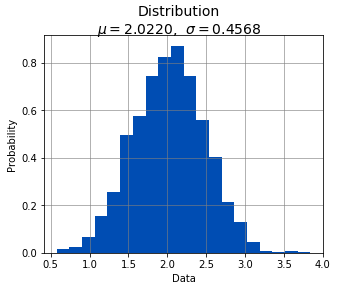
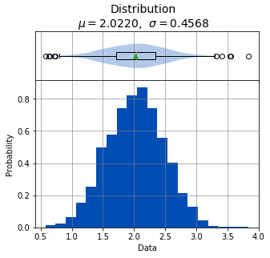
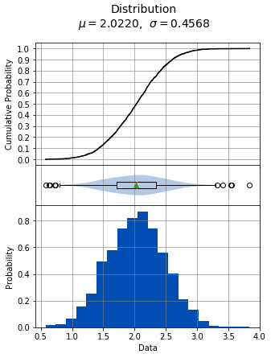
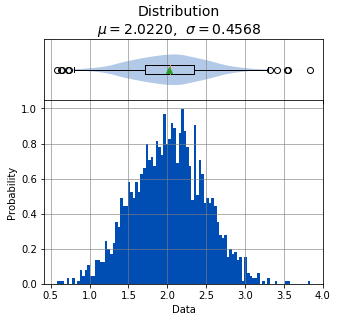
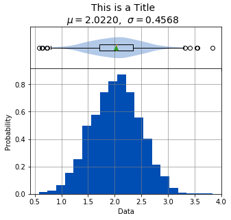
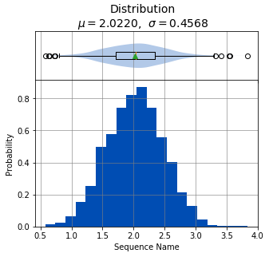
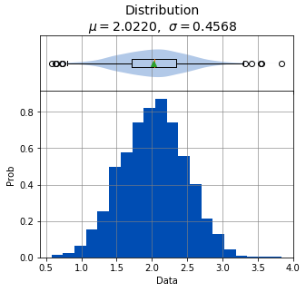

# Distribution

A [distribution](https://en.wikipedia.org/wiki/Probability_distribution) describes the spread and tendency of a collection of numeric data. In this case, the spread is the relative distance of a data point to the other data points. You can think of this as data points being grouped close to one another, or spread far apart from one another. A common measurement of this spread is [variance](https://en.wikipedia.org/wiki/Variance), which is the spread from the mean of a distribution.

[Mean](https://en.wikipedia.org/wiki/Mean) measures the central tendency of a distribution. Tendency refers to when data points "tend" to group closely to one another. This is easily calculated by summing all the values of the data points and dividing by the total number of data points **n**.

A distribution is represented on a graph by a [histogram](https://en.wikipedia.org/wiki/Histogram). A histogram charts a distribution by separating the numeric data in the distribution into discrete bins along the x-axis. These bins are charted as bars, where the height of each bar represents how many numeric values are in that bin.

A distribution represented by a histogram closely resembles a [probability density function](https://en.wikipedia.org/wiki/Probability_density_function) for continuous numeric data, or a [probability mass function](https://en.wikipedia.org/wiki/Probability_mass_function) for discrete numeric data.

## Interpreting the Graphs

The distribution analysis can show three graphs, the histogram, boxplot, and cumulative distribution plot. 

Let's first import sci-analysis and setup some variables to use in these examples.


```python
import numpy as np
import scipy.stats as st
from sci_analysis import analyze

%matplotlib inline
```


```python
# Create sequence from random variables.
np.random.seed(987654321)
sequence = st.norm.rvs(2, 0.45, size=2000)
```

### Histogram

The histogram, as described above, separates numeric data into discrete bins along the x-axis. The y-axis is the probability that a data point from a given distribution will belong to a particular bin.


```python
analyze(
    sequence, 
    boxplot=False,
)
```





    
    
    Statistics
    ----------
    
    n         =  2000
    Mean      =  2.0220
    Std Dev   =  0.4568
    Std Error =  0.0102
    Skewness  = -0.0017
    Kurtosis  = -0.0747
    Maximum   =  3.8397
    75%       =  2.3453
    50%       =  2.0295
    25%       =  1.7090
    Minimum   =  0.5786
    IQR       =  0.6363
    Range     =  3.2611
    
    
    Shapiro-Wilk test for normality
    -------------------------------
    
    alpha   =  0.0500
    W value =  0.9993
    p value =  0.6430
    
    H0: Data is normally distributed
    


### Boxplot

Boxplots in sci-analysis are actually a hybrid of two distribution visualization techniques, the boxplot and the [violin plot](https://en.wikipedia.org/wiki/Violin_plot). Boxplots are a good way to quickly understand a distribution, but can be misleading when the distribution is [multimodal](https://en.wikipedia.org/wiki/Multimodal_distribution). A violin plot does a much better job at showing local maxima and minima of a distribution.

In the center of each box is a red line and green triangle. The green triangle represents the mean of the group while the red line represents the median, sometimes referred to as the second quartile (Q2) or 50% line. The circles that might be seen at either end of the boxplot are outliers, and referred to as such because they are in the bottom 5% and top 95% of the distribution.


```python
analyze(sequence)
```





    
    
    Statistics
    ----------
    
    n         =  2000
    Mean      =  2.0220
    Std Dev   =  0.4568
    Std Error =  0.0102
    Skewness  = -0.0017
    Kurtosis  = -0.0747
    Maximum   =  3.8397
    75%       =  2.3453
    50%       =  2.0295
    25%       =  1.7090
    Minimum   =  0.5786
    IQR       =  0.6363
    Range     =  3.2611
    
    
    Shapiro-Wilk test for normality
    -------------------------------
    
    alpha   =  0.0500
    W value =  0.9993
    p value =  0.6430
    
    H0: Data is normally distributed
    


### Cumulative Distribution Function

The cumulative distribution function (cdf) differs from the probability density function in that it directly shows the probability of a data point occurring at a particular value in the distribution. The x-axis is the value in the distribution and the y-axis is the probability. For example, the center line of the y-axis is the 0.5 line (also known as the second quartile or Q2), and where the cdf crosses the 0.5 line is the median of the distribution.


```python
analyze(
    sequence, 
    boxplot=False, 
    cdf=True,
)
```


    
    
    Statistics
    ----------
    
    n         =  2000
    Mean      =  2.0220
    Std Dev   =  0.4568
    Std Error =  0.0102
    Skewness  = -0.0017
    Kurtosis  = -0.0747
    Maximum   =  3.8397
    75%       =  2.3453
    50%       =  2.0295
    25%       =  1.7090
    Minimum   =  0.5786
    IQR       =  0.6363
    Range     =  3.2611
    
    
    Shapiro-Wilk test for normality
    -------------------------------
    
    alpha   =  0.0500
    W value =  0.9993
    p value =  0.6430
    
    H0: Data is normally distributed
    


## Interpreting the Statistics

There are two types of data that accompany the distribution analysis -- the summary statistics and the test for normality. 

### Summary Statistics
* **n** - The number of data points in the analysis.
* **Mean** - The arithmetic mean or average of the analysis.
* **Std Dev** - The [standard deviation](https://en.wikipedia.org/wiki/Standard_deviation) of the analysis.
* **Std Error** - The [standard error](https://en.wikipedia.org/wiki/Standard_error) of the analysis.
* **Skewness** - A measure of how [skewed](https://en.wikipedia.org/wiki/Skewness) the distribution is towards the min or max.
* **Kurtosis** - The [kurtosis](https://en.wikipedia.org/wiki/Kurtosis) is a measure of how peaky the distribution is.
* **Maximum** - The largest value in the distribution.
* **75%** - The third [quartile](https://en.wikipedia.org/wiki/Quartile) (Q3) of the distribution.
* **50%** - The second [quartile](https://en.wikipedia.org/wiki/Quartile) (Q2) or median of the distribution.
* **25%** - The first [quartile](https://en.wikipedia.org/wiki/Quartile) (Q1) of the distribution.
* **Minimum** - The smallest value in the distribution.
* **IQR** - The [interquartile](https://en.wikipedia.org/wiki/Interquartile_range) range of the distribution, which is calculated by Q3 - Q1.
* **Range** - The range of the distribution measured by Maximum - Minimum.

### Test for normality

The [Shapiro-Wilk test](https://en.wikipedia.org/wiki/Shapiro–Wilk_test) attempts to determine if the distribution closely resembles the normal distribution. If the p value is less than or equal to alpha, the distribution is considered to not be normally distributed.

## Usage
.. py:function:: analyze(sequence[, box_plot=True, cdf=False, sample=False, bins=20, title='Distribution', name='Data', xname='Data', yname='Probability', save_to=None])

    Perform a Probability Distribution analysis on sequence.
    
    :param array-like sequence: The array-like object to analyze. It can be a list, tuple, numpy array or pandas Series of numeric values.
    :param bool boxplot: Display the accompanying box plot if **True**.
    :param bool cdf: Display the accompanying Cumulative Distribution Plot if **True**.
    :param bool sample: Sets x-bar and s if **True**, else mu and sigma when calculating summary statistics.
    :param int bins: The number of histogram bins to draw. The default value is 20.
    :param str title: The title of the graph.
    :param str name: The name of the distribution to show on the graph.
    :param str xname: Alias for name.
    :param str yname: The label of the y-axis of the histogram.
## Argument Examples

### sequence

The bare minimum requirement for performing a Distribution analysis. Should be an array-like of numeric values.


```python
analyze(sequence)
```


    
    
    Statistics
    ----------
    
    n         =  2000
    Mean      =  2.0220
    Std Dev   =  0.4568
    Std Error =  0.0102
    Skewness  = -0.0017
    Kurtosis  = -0.0747
    Maximum   =  3.8397
    75%       =  2.3453
    50%       =  2.0295
    25%       =  1.7090
    Minimum   =  0.5786
    IQR       =  0.6363
    Range     =  3.2611
    
    
    Shapiro-Wilk test for normality
    -------------------------------
    
    alpha   =  0.0500
    W value =  0.9993
    p value =  0.6430
    
    H0: Data is normally distributed
    


### boxplot

Controls whether the [boxplot](https://en.wikipedia.org/wiki/Box_plot) above the histogram is displayed or not. The default value is **True**.


```python
analyze(
    sequence, 
    boxplot=False,
)
```


    
    
    Statistics
    ----------
    
    n         =  2000
    Mean      =  2.0220
    Std Dev   =  0.4568
    Std Error =  0.0102
    Skewness  = -0.0017
    Kurtosis  = -0.0747
    Maximum   =  3.8397
    75%       =  2.3453
    50%       =  2.0295
    25%       =  1.7090
    Minimum   =  0.5786
    IQR       =  0.6363
    Range     =  3.2611
    
    
    Shapiro-Wilk test for normality
    -------------------------------
    
    alpha   =  0.0500
    W value =  0.9993
    p value =  0.6430
    
    H0: Data is normally distributed
    


### cdf

Controls whether the [cumulative distribution function](https://en.wikipedia.org/wiki/Cumulative_distribution_function) is displayed or not. The default value is **False**.


```python
analyze(
    sequence, 
    cdf=True,
)
```





    
    
    Statistics
    ----------
    
    n         =  2000
    Mean      =  2.0220
    Std Dev   =  0.4568
    Std Error =  0.0102
    Skewness  = -0.0017
    Kurtosis  = -0.0747
    Maximum   =  3.8397
    75%       =  2.3453
    50%       =  2.0295
    25%       =  1.7090
    Minimum   =  0.5786
    IQR       =  0.6363
    Range     =  3.2611
    
    
    Shapiro-Wilk test for normality
    -------------------------------
    
    alpha   =  0.0500
    W value =  0.9993
    p value =  0.6430
    
    H0: Data is normally distributed
    


### sample

Controls whether the analysis is performed assuming whether *sequence* is a sample if **True**, or a population if **False**. The default value is **False**.


```python
analyze(
    sequence, 
    sample=True,
)
```


    
    
    Statistics
    ----------
    
    n         =  2000
    Mean      =  2.0220
    Std Dev   =  0.4569
    Std Error =  0.0102
    Skewness  = -0.0017
    Kurtosis  = -0.0747
    Maximum   =  3.8397
    75%       =  2.3453
    50%       =  2.0295
    25%       =  1.7090
    Minimum   =  0.5786
    IQR       =  0.6363
    Range     =  3.2611
    
    
    Shapiro-Wilk test for normality
    -------------------------------
    
    alpha   =  0.0500
    W value =  0.9993
    p value =  0.6430
    
    H0: Data is normally distributed
    


### bins

Controls the number of bins to use for the histogram. The default value is 20.


```python
analyze(
    sequence, 
    bins=100,
)
```





    
    
    Statistics
    ----------
    
    n         =  2000
    Mean      =  2.0220
    Std Dev   =  0.4568
    Std Error =  0.0102
    Skewness  = -0.0017
    Kurtosis  = -0.0747
    Maximum   =  3.8397
    75%       =  2.3453
    50%       =  2.0295
    25%       =  1.7090
    Minimum   =  0.5786
    IQR       =  0.6363
    Range     =  3.2611
    
    
    Shapiro-Wilk test for normality
    -------------------------------
    
    alpha   =  0.0500
    W value =  0.9993
    p value =  0.6430
    
    H0: Data is normally distributed
    


### title

The title of the distribution to display above the graph.


```python
analyze(
    sequence, 
    title='This is a Title',
)
```





    
    
    Statistics
    ----------
    
    n         =  2000
    Mean      =  2.0220
    Std Dev   =  0.4568
    Std Error =  0.0102
    Skewness  = -0.0017
    Kurtosis  = -0.0747
    Maximum   =  3.8397
    75%       =  2.3453
    50%       =  2.0295
    25%       =  1.7090
    Minimum   =  0.5786
    IQR       =  0.6363
    Range     =  3.2611
    
    
    Shapiro-Wilk test for normality
    -------------------------------
    
    alpha   =  0.0500
    W value =  0.9993
    p value =  0.6430
    
    H0: Data is normally distributed
    


### name, xname

The name of the distribution to display on the x-axis.


```python
analyze(
    sequence, 
    name='Sequence Name',
)
```





    
    
    Statistics
    ----------
    
    n         =  2000
    Mean      =  2.0220
    Std Dev   =  0.4568
    Std Error =  0.0102
    Skewness  = -0.0017
    Kurtosis  = -0.0747
    Maximum   =  3.8397
    75%       =  2.3453
    50%       =  2.0295
    25%       =  1.7090
    Minimum   =  0.5786
    IQR       =  0.6363
    Range     =  3.2611
    
    
    Shapiro-Wilk test for normality
    -------------------------------
    
    alpha   =  0.0500
    W value =  0.9993
    p value =  0.6430
    
    H0: Data is normally distributed
    


```python
analyze(
    sequence, 
    xname='Sequence Name',
)
```


    
    
    Statistics
    ----------
    
    n         =  2000
    Mean      =  2.0220
    Std Dev   =  0.4568
    Std Error =  0.0102
    Skewness  = -0.0017
    Kurtosis  = -0.0747
    Maximum   =  3.8397
    75%       =  2.3453
    50%       =  2.0295
    25%       =  1.7090
    Minimum   =  0.5786
    IQR       =  0.6363
    Range     =  3.2611
    
    
    Shapiro-Wilk test for normality
    -------------------------------
    
    alpha   =  0.0500
    W value =  0.9993
    p value =  0.6430
    
    H0: Data is normally distributed
    


### yname

The value to display along the y-axis.


```python
analyze(
    sequence, 
    yname='Prob',
)
```





    
    
    Statistics
    ----------
    
    n         =  2000
    Mean      =  2.0220
    Std Dev   =  0.4568
    Std Error =  0.0102
    Skewness  = -0.0017
    Kurtosis  = -0.0747
    Maximum   =  3.8397
    75%       =  2.3453
    50%       =  2.0295
    25%       =  1.7090
    Minimum   =  0.5786
    IQR       =  0.6363
    Range     =  3.2611
    
    
    Shapiro-Wilk test for normality
    -------------------------------
    
    alpha   =  0.0500
    W value =  0.9993
    p value =  0.6430
    
    H0: Data is normally distributed
    

