.. sci_analysis documentation master file, created by
   sphinx-quickstart on Wed Dec 30 21:49:27 2015.
   You can adapt this file completely to your liking, but it should at least
   contain the root `toctree` directive.

What is sci_analysis?
=====================

sci_analysis is a python package for quickly performing statistical data analysis. It provides a graphical representation of the supplied data and also performs the statistical analysis. sci_analysis is smart enough to determine the correct analysis and tests to perform based on the shape of the data or number of arguments you provide, as well as how the data is distributed.

Currently, sci_analysis can only be used for analyzing numeric data. Categorical data analysis is planned for a future version. The three types of analysis that can be performed are histograms of single vectors, correlation between two vectors and a comparison of means between multiple vectors.

What's new in sci_analysis version 2.0?
=======================================

* In version 2.0, the code base was re-factored to use pandas as the internal data structure instead of numpy. This change shouldn't have a noticeable effect, but should lead to faster releases moving forward. 
* Categorical data is now supported by passing in a single array of string values to the ``analyze`` function. 
* Multiple scatter plots can now be shown on the same graph by passing in a *groups* argument.
* Oneway analysis can now be performed on stacked data by passing in all the data to the ``analyze`` function and an array of the corresponding groups using the *groups* argument.
* The function ``analyse`` was added as an alias to ``analyze``.

Getting started with sci_analysis
=================================

sci_analysis requires python 2.7, 3.5, or 3.6.

If you use OS X or Linux, python should already be installed. You can check by opening a terminal window and typing ``which python`` on the command line. To verify what version of python you have installed, type ``python --version`` at the command line. If the version is 2.7.x, 3.5.x or 3.6.x, where x is any number, sci_analysis should work properly.

If you are on Windows, you might need to install python. You can check to see if python is installed by clicking the Start button, typing ``cmd`` in the run text box, then type ``python.exe`` on the command line. If you receive an error message, you need to install python. The easiest way to install python is by installing Anaconda or Mini-conda from this page:

`<https://www.continuum.io/downloads>`_

Alternatively, you can download the python binary from the following page, but be warned that installing the required packages can be difficult using this method:

`<https://www.python.org/downloads/windows/>`_

Installing sci_analysis
=======================

sci_analysis can be installed with pip by typing the following:

::
    
    pip install sci_analysis
    
On Linux, you can install pip from your OS package manager. If you have Anaconda or Mini-conda, pip should already be installed. Otherwise, you can download pip from the following page:

`<https://pypi.python.org/pypi/pip>`_

sci_analysis works best in conjunction with the excellent pandas and jupyter notebook python packages. If you don't have either of these packages installed, you can install them by typing the following:

::

    pip install pandas
    pip install jupyter

Using sci_analysis
==================

From the python interpreter or in the first cell of a Jupyter notebook, type:

::
    
    import numpy as np
    import scipy.stats as st
    from sci_analysis import analyze

.. note:: The package name is ``sci_analysis`` with an underscore.

This will tell python to import the sci_analysis function ``analyze``.

If you are using the Jupyter notebook, you may also need to use the following code instead to enable inline plots:

::
    
    %matplotlib inline
    import numpy as np
    import scipy.stats as st
    from sci_analysis import analyze

Now, sci_analysis should be ready to use. Try the following code:

::
    
    np.random.seed(987654321)
    data = st.norm.rvs(size=1000)
    analyze(data)

A histogram and box plot of the data should appear, as well as printed output similar to that below:

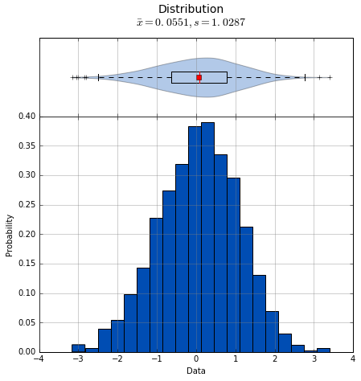

::

    Statistics
    ----------
 
    Count     =  1000
    Mean      =  0.0551
    Std Dev   =  1.0287
    Std Error =  0.0325
    Skewness  = -0.1439
    Kurtosis  = -0.0931
    Maximum   =  3.4087
    75%       =  0.7763
    50%       =  0.0897
    25%       = -0.6324
    Minimum   = -3.1586
    IQR       =  1.4087
    Range     =  6.5673
 
 
    Shapiro-Wilk test for normality
    -------------------------------
 
    W value =  0.9979
    p value =  0.2591
 
    H0: Data is normally distributed

If ``data`` contains missing values or strings, they will be ignored when generating the statistics and graphing the histogram.

.. note:: numpy and scipy.stats were only imported for the purpose of the above example. sci_analysis uses numpy and scipy internally, so it isn't necessary to import them unless you want to explicitly use them. 

Let's examine the ``analyze`` function in more detail. Here's the signature for the ``analyze`` function:

.. py:function:: analyze(*data, **kwargs)

    Automatically performs a statistical analysis based on the input arguments.
    
    Parameters
    ----------
    xdata : array-like or list(array-like) or dict(array-like)
        The primary set of data.
    ydata : array-like
        The response data set.
    groups : array-like
        The group names used for a oneway analysis.

``analyze`` will detect the desired type of data analysis to perform based on whether the ``ydata`` argument is supplied, and whether the ``xdata`` argument is a two-dimensional array-like object. 

The ``xdata`` and ``ydata`` arguments can accept most python array-like objects, with the exception of strings. For example, ``xdata`` will accept a python list, tuple, numpy array, or a pandas Series object. Internally, iterable objects are converted to a Vector object, which is a numpy array of type ``float64``.

If only the ``xdata`` argument is passed and it is a one-dimensional vector, the analysis performed will be a histogram of the vector with basic statistics and Shapiro-Wilk normality test. This is useful for visualizing the distribution of the vector.

If ``xdata`` and ``ydata`` are supplied and are both one-dimensional vectors, an x, y scatter plot with line fit will be graphed and the correlation between the two vectors will be calculated. If there are non-numeric or missing values in either vector, they will be ignored. Only values that are numeric in each vector, at the same index will be included in the correlation. For example, the two following vectors will yield:

::

    example1 = [0.2, 0.25, 0.27, "nan", 0.32, 0.38, 0.39, "nan", 0.42, 0.43, 0.47, 0.51, 0.52, 0.56, 0.6]
    example2 = [0.23, 0.27, 0.29, "nan", 0.33, 0.35, 0.39, 0.42, "nan", 0.46, 0.48, 0.49, "nan", 0.5, 0.58]
    analyze(example1, example2)

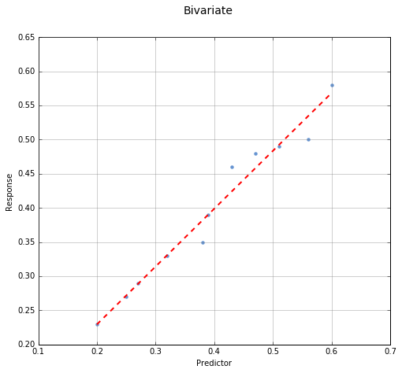

::
    
    Linear Regression
    -----------------

    count     = 11
    slope     = 0.8467
    intercept = 0.0601
    R^2       = 0.9836
    std err   = 0.0518
    p value   = 0.0000

    HA: There is a significant relationship between predictor and response

    Correlation
    -----------

    Pearson Coeff:
    r = 0.9836
    p = 0.0000

    HA: There is a significant relationship between predictor and response

If ``xdata`` is a sequence or dictionary of vectors, summary statistics will be reported for each vector. If each vector is normally distributed and they all have equal variance, a one-way ANOVA is performed. If the data is not normally distributed or the vectors do not have equal variance, a non-parametric Kruskal-Wallis test will be performed instead of a one-way ANOVA.

.. note:: Vectors should be independent from one another --- that is to say, there should not be values in one vector that are derived from or some how related to a value in another vector. These dependencies can lead to weird and often unpredictable results. 

For example, a proper use case would be if you had a table with measurement data for multiple groups, such as test scores per class, average height per country or measurements per trial run, where the classes, countries and trials are the groups. In this case, each group should be represented by it's own vector, which are then all wrapped in a dictionary or sequence. 

If ``xdata`` is supplied as a dictionary, the keys are the names of the groups and the values are the array-like objects that represent the vectors. Alternatively, ``xdata`` can be a python sequence of the vectors and the ``groups`` argument a list of strings of the group names. The order of the group names should match the order of the vectors passed to ``xdata``. For example:

::
    
    np.random.seed(987654321)
    group_a = st.norm.rvs(size=50)
    group_b = st.norm.rvs(size=25)
    group_c = st.norm.rvs(size=30)
    group_d = st.norm.rvs(size=40)
    analyze({"Group A": group_a, "Group B": group_b, "Group C": group_c, "Group D": group_d})
    
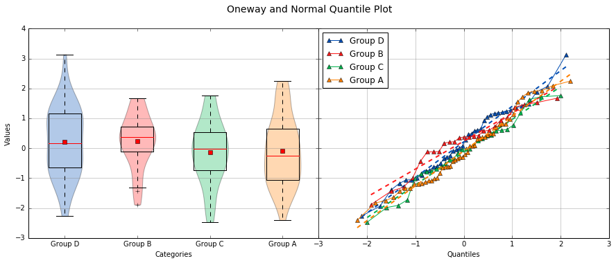

::
    
    Group Statistics
 
    Count         Mean          Std Dev       Min           Median        Max           Group         
    --------------------------------------------------------------------------------------------------
    40             0.2159        1.1629       -2.2678        0.1747        3.1400       Group D       
    25             0.2403        0.9181       -1.8853        0.3791        1.6715       Group B       
    30            -0.1282        1.0652       -2.4718       -0.0266        1.7617       Group C       
    50            -0.0891        1.1473       -2.4036       -0.2490        2.2466       Group A       
 
 
    Bartlett Test
    -------------
 
    T value =  1.8588
    p value =  0.6022
 
    H0: Variances are equal
 
 
    Oneway ANOVA
    ------------
 
    f value =  1.0813
    p value =  0.3591
 
    H0: Group means are matched

In the example above, sci_analysis is telling us the four groups are normally distributed (by use of the Bartlett Test, Oneway ANOVA and the near straight line fit on the quantile plot), the groups have equal variance and the groups have matching means. The only significant difference between the four groups is the sample size we specified. Let's try another example, but this time change the variance of group B:

::
    
    np.random.seed(987654321)
    group_a = st.norm.rvs(0.0, 1, size=50)
    group_b = st.norm.rvs(0.0, 3, size=25)
    group_c = st.norm.rvs(0.1, 1, size=30)
    group_d = st.norm.rvs(0.0, 1, size=40)
    analyze({"Group A": group_a, "Group B": group_b, "Group C": group_c, "Group D": group_d})

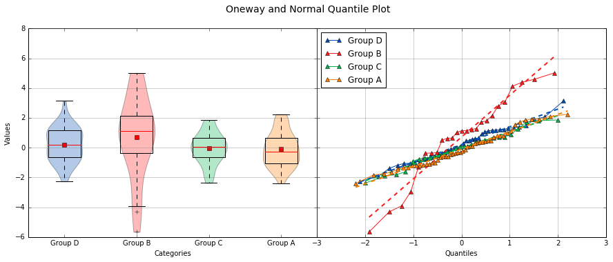

::
    
    Group Statistics
 
    Count         Mean          Std Dev       Min           Median        Max           Group         
    --------------------------------------------------------------------------------------------------
    40             0.2159        1.1629       -2.2678        0.1747        3.1400       Group D       
    25             0.7209        2.7543       -5.6558        1.1374        5.0146       Group B       
    30            -0.0282        1.0652       -2.3718        0.0734        1.8617       Group C       
    50            -0.0891        1.1473       -2.4036       -0.2490        2.2466       Group A       
 
 
    Bartlett Test
    -------------
 
    T value =  42.7597
    p value =  0.0000
 
    HA: Variances are not equal
 
 
    Kruskal-Wallis
    --------------
 
    p value =  0.0660
    h value =  7.1942
 
    H0: Group means are matched

In the example above, group B has a standard deviation of 2.75 compared to the other groups that are approximately 1. The quantile plot on the right also shows group B has a much steeper slope compared to the other groups, implying a larger variance. Also, the Kruskal-Wallis test was used instead of the Oneway ANOVA because the pre-requisite of equal variance was not met.

In another example, let's compare groups that have different distibutions and different means:

::
    
    np.random.seed(987654321)
    group_a = st.norm.rvs(0.0, 1, size=50)
    group_b = st.norm.rvs(0.0, 3, size=25)
    group_c = st.weibull_max.rvs(1.2, size=30)
    group_d = st.norm.rvs(0.0, 1, size=40)
    analyze({"Group A": group_a, "Group B": group_b, "Group C": group_c, "Group D": group_d})

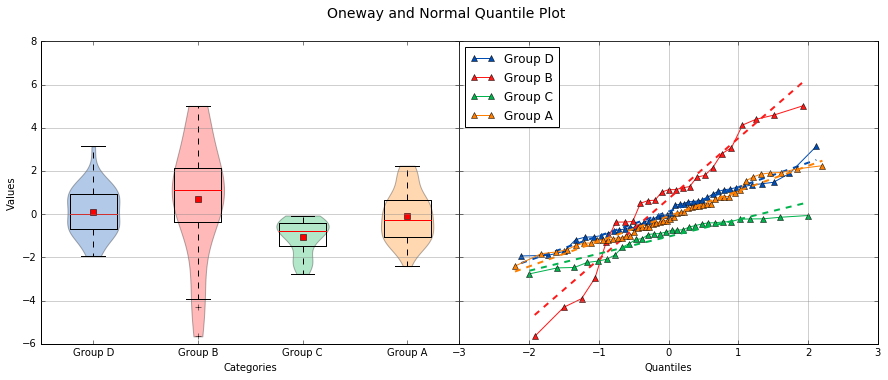

::
    
    Group Statistics
 
    Count         Mean          Std Dev       Min           Median        Max           Group         
    --------------------------------------------------------------------------------------------------
    40             0.1246        1.1081       -1.9334        0.0193        3.1400       Group D       
    25             0.7209        2.7543       -5.6558        1.1374        5.0146       Group B       
    30            -1.0340        0.8029       -2.7632       -0.7856       -0.0606       Group C       
    50            -0.0891        1.1473       -2.4036       -0.2490        2.2466       Group A       
 
 
    Levene Test
    -----------
 
    W value =  10.1675
    p value =  0.0000
 
    HA: Variances are not equal
 
 
    Kruskal-Wallis
    --------------
 
    p value =  0.0000
    h value =  23.8694
 
    HA: Group means are not matched

.. note:: If a dict is passed to the analyze function, the groups are reported in arbitrary order. This will be fixed in a future release.

The above example models group C as a Weibull distribution, while the other groups are normally distributed. You can see the difference in the distributions by the one-sided tail on the group C boxplot, and the curved shape of group C on the quantile plot. Group B has the highest mean at 0.72, which can be seen in the quantile plot and indicated by the Kruskal-Wallis test.

Alternatively, the above example can be repeated where the groups are in the specified order by setting ``xdata`` as a list and the ``groups`` argument as a list of the group names.

::

    np.random.seed(987654321)
    group_a = st.norm.rvs(0.0, 1, size=50)
    group_b = st.norm.rvs(0.0, 3, size=25)
    group_c = st.weibull_max.rvs(1.2, size=30)
    group_d = st.norm.rvs(0.0, 1, size=40)
    analyze([group_a, group_b, group_c, group_d], groups=['Group A', 'Group B', 'Group C', 'Group D'])

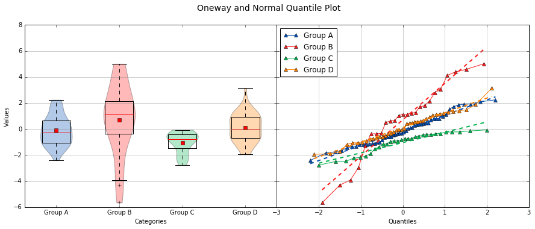

::

    Group Statistics
 
    Count         Mean          Std Dev       Min           Median        Max           Group         
    --------------------------------------------------------------------------------------------------
    40             0.1246        1.1081       -1.9334        0.0193        3.1400       Group D       
    25             0.7209        2.7543       -5.6558        1.1374        5.0146       Group B       
    30            -1.0340        0.8029       -2.7632       -0.7856       -0.0606       Group C       
    50            -0.0891        1.1473       -2.4036       -0.2490        2.2466       Group A       
 
 
    Levene Test
    -----------
 
    W value =  10.1675
    p value =  0.0000
 
    HA: Variances are not equal
 
 
    Kruskal-Wallis
    --------------
 
    p value =  0.0000
    h value =  23.8694
 
    HA: Group means are not matched

Using sci_analysis with pandas
==============================

Pandas is a python package that simplifies working with tabular or relational data. Sci_analysis does not depend on or installs pandas, but the two packages work well together. Because columns and rows of data in a pandas DataFrame are naturally array-like, using pandas with sci_analysis is the prefered way to use sci_analysis.

Let's create a pandas DataFrame to use for analysis:

::

    import pandas as pd
    np.random.seed(987654321)
    df = pd.DataFrame({'One'   : st.norm.rvs(0.0, 1, size=60),
                       'Two'   : st.norm.rvs(0.0, 3, size=60),
                       'Three' : st.weibull_max.rvs(1.2, size=60),
                       'Four'  : st.norm.rvs(0.0, 1, size=60),
                       'Month' : ['Jan', 'Feb', 'Mar', 'Apr', 'May', 'Jun', 'Jul', 'Aug', 'Sep', 'Oct', 'Nov', 'Dec'] * 5,
                       'Condition' : ['Group A', 'Group B', 'Group C', 'Group D'] * 15})
    df

This will create a table (pandas DataFrame object) with 6 columns and an index which is the row id. The following command can be used to analyze the distribution of the column titled 'One':

::

    analyze(df['One'], 
            name='Column One', 
            title='Distribution from pandas')

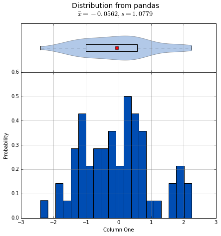

::

    Statistics
    ----------
 
    Count     =  60
    Mean      = -0.0562
    Std Dev   =  1.0779
    Std Error =  0.1392
    Skewness  =  0.1879
    Kurtosis  = -0.5109
    Maximum   =  2.2466
    75%       =  0.5793
    50%       = -0.0228
    25%       = -0.9999
    Minimum   = -2.4036
    IQR       =  1.5792
    Range     =  4.6501
 
 
    Shapiro-Wilk test for normality
    -------------------------------
 
    W value =  0.9796
    p value =  0.4131
 
    H0: Data is normally distributed

The following command can be used to analyze the correlation between columns 'One' and 'Three':

::

    analyze(df['One'], df['Three'], 
            xname='Column One', 
            yname='Column Three', 
            title='Bivariate from pandas')

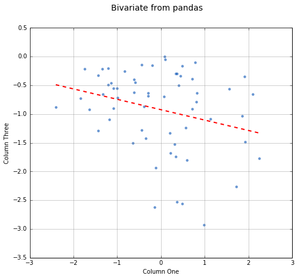

::

    Linear Regression
    -----------------
 
    Count     =  60
    Slope     = -0.1807
    Intercept = -0.9249
    R^2       = -0.2742
    Std Err   =  0.0832
    p value   =  0.0340
 
    HA: There is a significant relationship between predictor and response
 
 
    Spearman Correlation Coefficient
    --------------------------------
 
    p value =  0.0785
    r value = -0.2289
 
    H0: There is no significant relationship between predictor and response

Anywhere you use a python list or numpy Array in sci_analysis, you can use a column or row of a pandas DataFrame (known in pandas terms as a Series). This is because a pandas Series has much of the same behavior as a numpy Array, causing sci_analysis to handle a pandas Series as if it were a numpy Array.

Performing a Oneway analysis on data in a pandas DataFrame requires some explanation. The simplist way to perform a Oneway analysis is to iterate over a pandas groupby object in a list comprehension. You can find a great explanation of what list comprehensions are and how to use them here:

`<http://treyhunner.com/2015/12/python-list-comprehensions-now-in-color/>`_

Let's start with an example. The following code will perform a Oneway analysis using each of the four values in the 'Conditions' column:

::

    analyze([group['Two'] for name, group in df.groupby(df['Condition'])], 
             groups=['Group A', 'Group B', 'Group C', 'Group D'],
             categories='Groups',
             name='Column Two',
             title='Oneway from pandas')

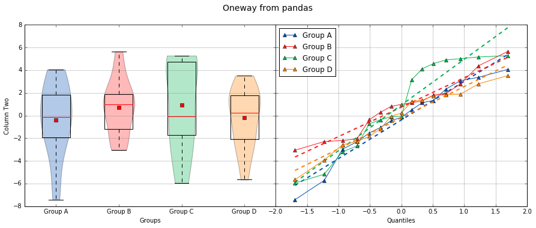

::

    Group Statistics
 
    Count         Mean          Std Dev       Min           Median        Max           Group         
    --------------------------------------------------------------------------------------------------
    15            -0.1906        2.6335       -5.6558        0.2217        3.5229       Group D       
    15             0.7406        2.4806       -3.0538        0.9879        5.6546       Group B       
    15             0.9334        3.9554       -5.9492       -0.0510        5.2850       Group C       
    15            -0.3873        3.2660       -7.4153       -0.1489        4.0653       Group A       
 
 
    Bartlett Test
    -------------
 
    T value =  3.7931
    p value =  0.2847
 
    H0: Variances are equal
 
 
    Oneway ANOVA
    ------------
 
    f value =  0.6628
    p value =  0.5784
 
    H0: Group means are matched

From the graph, there are four groups: Group A, Group B, Group C and Group D. The data being analyzed is from column 'Two', the variances are equal and there is no significant difference in the means. So how does this work? The argument is a single list comprehension with group names passed to the ``groups`` argument. The list comprehension can be thought of this way:

"For each unique value in the DataFrame's 'Condition' column, make a new list containing the values in column 'Two' where all the values in the 'Condition' column are the same".

Let's start by working from right to left. ``df.groupby(df['Condition'])`` splits the DataFrame ``df`` into four parts, where each part has all the rows where the 'Condition' column is 'Group A', 'Group B', 'Group C' and 'Group D'. ``for name, group in`` loops over each part where 'name' is 'Group A', 'Group B', 'Group C' and 'Group D' and 'group' is the part of ``df`` that corresponds to 'name'. Note that 'name' is not used in this example. A little more on this later. Last, ``group['Two']`` returns just column 'Two' for each part. Running the list comprehension by itself shows that it's a list with four lists, where each inner list is the column 'Two' for each group.

::

    [group['Two'] for name, group in df.groupby(df['Condition'])]

One thing to note is that the groups argument was used to explicitly define the group names. This will only work if the group names and order are known in advance. If they are unknown, a dictionary comprehension can be used instead of a list comprehension to to get the group names along with the data:

::

    analyze({name: group['Two'] for name, group in df.groupby(df['Condition'])}, 
             categories='Groups from Dictionary',
             name='Column Two',
             title='Oneway from pandas')

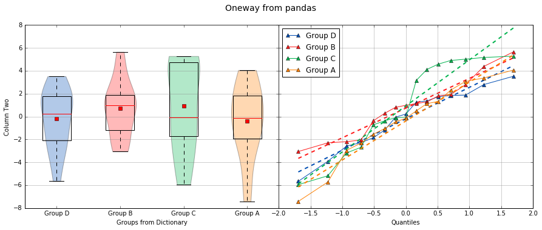

::

    Group Statistics
 
    Count         Mean          Std Dev       Min           Median        Max           Group         
    --------------------------------------------------------------------------------------------------
    15            -0.1906        2.6335       -5.6558        0.2217        3.5229       Group D       
    15             0.7406        2.4806       -3.0538        0.9879        5.6546       Group B       
    15             0.9334        3.9554       -5.9492       -0.0510        5.2850       Group C       
    15            -0.3873        3.2660       -7.4153       -0.1489        4.0653       Group A       
 
 
    Bartlett Test
    -------------
 
    T value =  3.7931
    p value =  0.2847
 
    H0: Variances are equal
 
 
    Oneway ANOVA
    ------------
 
    f value =  0.6628
    p value =  0.5784
 
    H0: Group means are matched

Notice that the dictionary comprehension produces the same results but in a different order, and did not require the 'groups' argument to be set. In this situation, 'name' in the dictionary comprehension represents the group names to be used, making the 'groups' argument unnecessary to set. Using a dictionary comprehension is fine when the groups are unknown, but not ideal if the boxplots should be shown in a particular order.

Let's consider an example where the data is grouped by the 'Month' column instead of 'Condition':

::

    data = list()
    months = list()
    for name, group in df.groupby(df['Month']):
        data.append(group['Two'])
        months.append(name)
    
    analyze(data,
            groups=months,
            categories='Months from List',
            name='Column Two',
            title='Oneway from pandas')

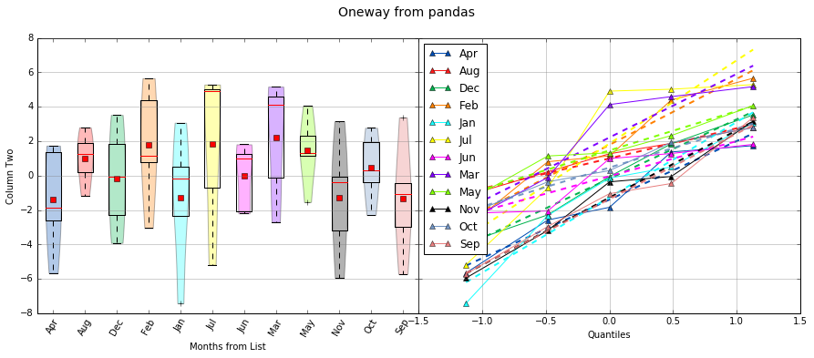

::

    Group Statistics
 
    Count         Mean          Std Dev       Min           Median        Max           Group         
    --------------------------------------------------------------------------------------------------
    5              2.2163        3.4431       -2.6899        4.1257        5.1658       Mar           
    5              1.7872        3.4116       -3.0538        1.1383        5.6546       Feb           
    5              0.9972        1.5334       -1.1743        1.2664        2.8004       Aug           
    5             -1.3628        3.3515       -5.7216       -1.0495        3.3774       Sep           
    5              1.4629        2.0392       -1.5363        1.3246        4.0653       May           
    5             -0.0327        1.9319       -2.1934        0.9879        1.8137       Jun           
    5              1.8617        4.6673       -5.1767        4.9062        5.2850       Jul           
    5             -1.2622        3.9392       -7.4153       -0.1489        3.0673       Jan           
    5             -1.3938        3.0508       -5.6558       -1.8426        1.7373       Apr           
    5             -1.2777        3.4456       -5.9492       -0.3654        3.1604       Nov           
    5             -0.1753        3.0070       -3.9105       -0.0537        3.5229       Dec           
    5              0.4673        1.9890       -2.2962        0.2914        2.7754       Oct           
 
 
    Bartlett Test
    -------------
 
    T value =  8.1523
    p value =  0.6996
 
    H0: Variances are equal
 
 
    Oneway ANOVA
    ------------
 
    f value =  0.9875
    p value =  0.4709
 
    H0: Group means are matched

In this example, a for loop is used to build the data and month lists. This method works well, but the months are graphed out of order. Since the possible months are known in advance, it's possible to set the months in the order they should appear in. This is done by creating a list called months with the ordered months, a dictionary comprehension called data and list comprehension that puts the values in data in the order of the months list:

::

    months = ['Jan', 'Feb', 'Mar', 'Apr', 'May', 'Jun', 'Jul', 'Aug', 'Sep', 'Oct', 'Nov', 'Dec']
    data = {month: data['Two'] for month, data in df.groupby(df['Month'])}
    analyze([data[month] for month in months],
            groups=months,
            categories='Ordered Months from Dictionary',
            name='Column Two',
            title='Oneway from pandas')

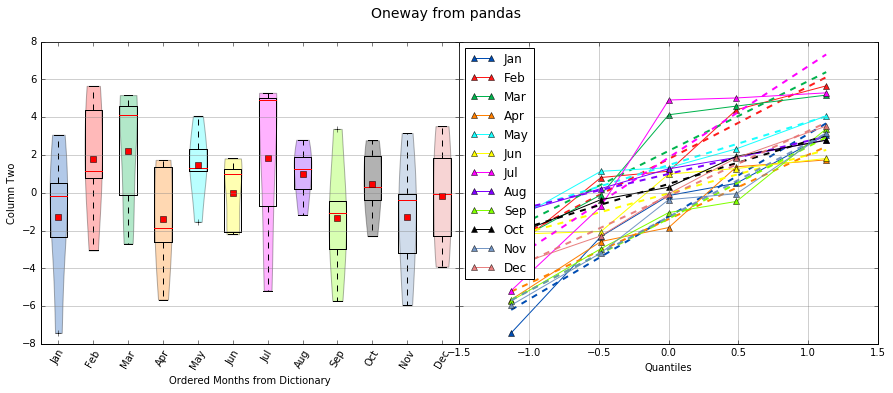

::

    Group Statistics
 
    Count         Mean          Std Dev       Min           Median        Max           Group         
    --------------------------------------------------------------------------------------------------
    5              2.2163        3.4431       -2.6899        4.1257        5.1658       Mar           
    5              1.7872        3.4116       -3.0538        1.1383        5.6546       Feb           
    5              0.9972        1.5334       -1.1743        1.2664        2.8004       Aug           
    5             -1.3628        3.3515       -5.7216       -1.0495        3.3774       Sep           
    5              1.4629        2.0392       -1.5363        1.3246        4.0653       May           
    5             -0.0327        1.9319       -2.1934        0.9879        1.8137       Jun           
    5              1.8617        4.6673       -5.1767        4.9062        5.2850       Jul           
    5             -1.2622        3.9392       -7.4153       -0.1489        3.0673       Jan           
    5             -1.3938        3.0508       -5.6558       -1.8426        1.7373       Apr           
    5             -1.2777        3.4456       -5.9492       -0.3654        3.1604       Nov           
    5             -0.1753        3.0070       -3.9105       -0.0537        3.5229       Dec           
    5              0.4673        1.9890       -2.2962        0.2914        2.7754       Oct           
 
 
    Bartlett Test
    -------------
 
    T value =  8.1523
    p value =  0.6996
 
    H0: Variances are equal
 
 
    Oneway ANOVA
    ------------
 
    f value =  0.9875
    p value =  0.4709
 
    H0: Group means are matched

In the last example, the months list was used to specify the order the box plots should be graphed in. The same technique can be applied for selecting particular groups, such as only comparing months that have 31 days.

::

    months = ['Jan', 'Mar', 'May', 'Jul', 'Aug', 'Oct', 'Dec']
    data = {month: data['Two'] for month, data in df.groupby(df['Month'])}
    analyze([data[month] for month in months],
            groups=months,
            categories='Months with 31 Days',
            name='Column Two',
            title='Oneway from pandas')

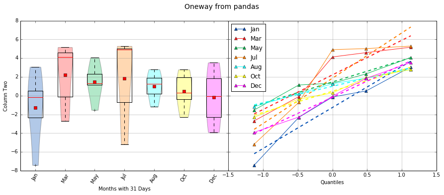

::

    Group Statistics
 
    Count         Mean          Std Dev       Min           Median        Max           Group         
    --------------------------------------------------------------------------------------------------
    5             -1.2622        3.9392       -7.4153       -0.1489        3.0673       Jan           
    5              2.2163        3.4431       -2.6899        4.1257        5.1658       Mar           
    5              0.9972        1.5334       -1.1743        1.2664        2.8004       Aug           
    5              1.4629        2.0392       -1.5363        1.3246        4.0653       May           
    5             -0.1753        3.0070       -3.9105       -0.0537        3.5229       Dec           
    5              0.4673        1.9890       -2.2962        0.2914        2.7754       Oct           
    5              1.8617        4.6673       -5.1767        4.9062        5.2850       Jul           
 
 
    Bartlett Test
    -------------
 
    T value =  6.6838
    p value =  0.3511
 
    H0: Variances are equal
 
 
    Oneway ANOVA
    ------------
 
    f value =  0.7583
    p value =  0.6085
 
    H0: Group means are matched

With pandas, it's possible to perform advanced aggregation and filtering functions using the GroupBy object's ``apply`` method. Since the sample sizes were small for each month in the above examples, it might be helpful to group the data by annual quarters instead. First, let's create a function that adds a column called 'Quarter' to the DataFrame where the value is either Q1, Q2, Q3 or Q4 depending on the month. 

::

    def set_quarter(data):
        month = data['Month']
        if month.all() in ('Jan', 'Feb', 'Mar'):
            quarter = 'Q1'
        elif month.all() in ('Apr', 'May', 'Jun'):
            quarter = 'Q2'
        elif month.all() in ('Jul', 'Aug', 'Sep'):
            quarter = 'Q3'
        elif month.all() in ('Oct', 'Nov', 'Dec'):
            quarter = 'Q4'
        else:
            quarter = 'Unknown'
        data.loc[:, 'Quarter'] = quarter
        return data

This function will take a GroupBy object called data, where data's DataFrame object was grouped by month, and set the variable quarter based off the month. Then, a new column called 'Quarter' is added to data where the value of each row is equal to quarter. Finally, the resulting DataFrame object is returned.

Using the new function is simple. The same techniques from previous examples are used, but this time, a new DataFrame object called df2 is created by first grouping by the 'Month' column then calling the ``apply`` method which will run the set_quarter function.

::

    quarters = ['Q1', 'Q2', 'Q3', 'Q4']
    df2 = df.groupby(df['Month']).apply(set_quarter)
    data = {quarter: data['Two'] for quarter, data in df2.groupby(df2['Quarter'])}
    analyze([data[quarter] for quarter in quarters],
            groups=quarters,
            categories='Quarters',
            name='Column Two',
            title='Oneway from pandas')

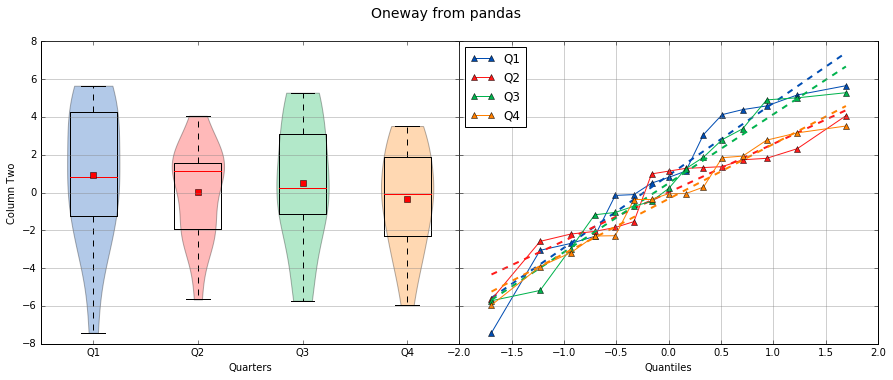

::

    Group Statistics
 
    Count         Mean          Std Dev       Min           Median        Max           Group         
    --------------------------------------------------------------------------------------------------
    15             0.9138        3.7034       -7.4153        0.8059        5.6546       Q1            
    15             0.4987        3.4778       -5.7216        0.2217        5.2850       Q3            
    15             0.0122        2.5243       -5.6558        1.1374        4.0653       Q2            
    15            -0.3286        2.7681       -5.9492       -0.0537        3.5229       Q4            
 
 
    Bartlett Test
    -------------
 
    T value =  2.6544
    p value =  0.4480
 
    H0: Variances are equal
 
 
    Oneway ANOVA
    ------------
 
    f value =  0.4474
    p value =  0.7201
 
    H0: Group means are matched