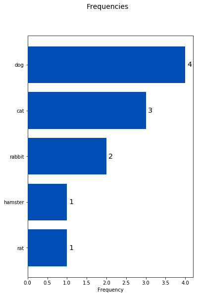
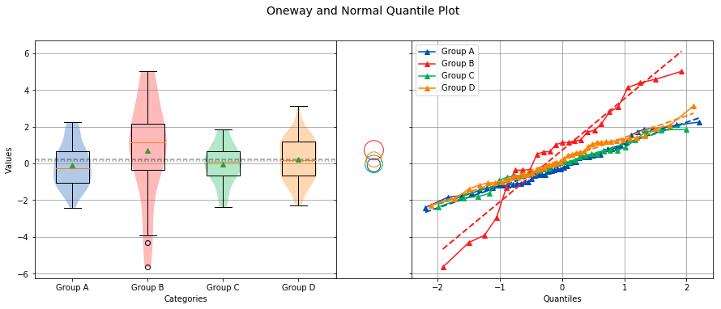
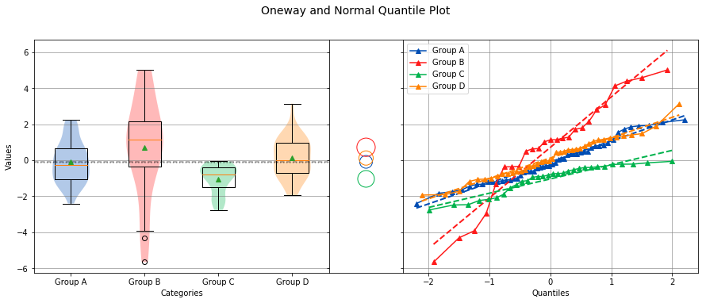
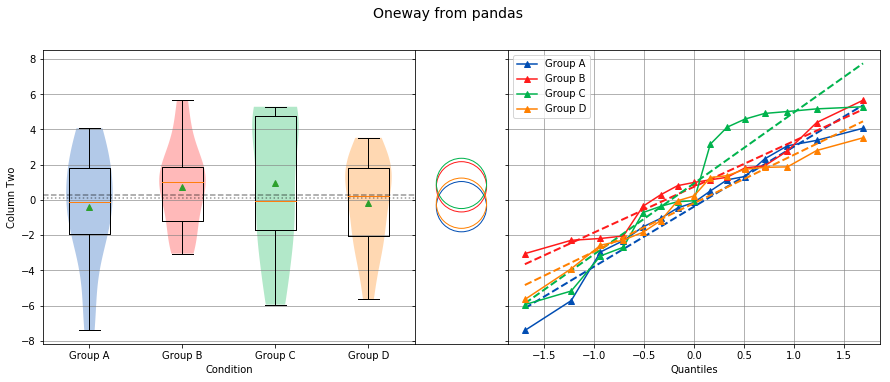
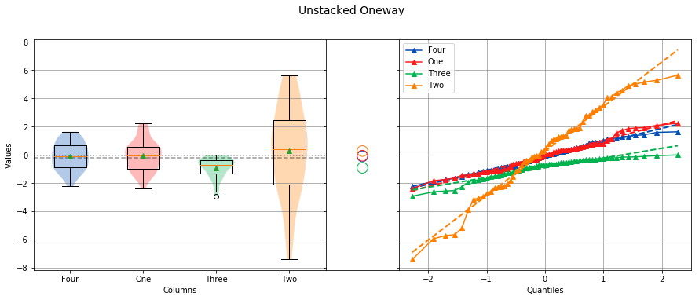
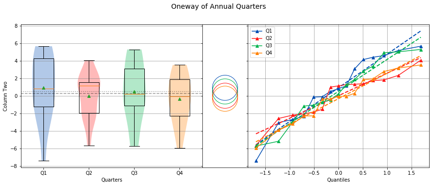

.. sci_analysis documentation master file, created by
   sphinx-quickstart on Wed Dec 30 21:49:27 2015.
   You can adapt this file completely to your liking, but it should at least
   contain the root `toctree` directive.

============
sci-analysis
============

An easy to use and powerful python-based data exploration and analysis tool

---------------
Current Version
---------------

2.0 --- Released December 31, 2017

What is sci_analysis?
=====================

sci_analysis is a python package for quickly performing statistical data analysis. It provides a graphical representation of the supplied data as well as performs the statistical analysis. sci_analysis is smart enough to determine the correct analysis and tests to perform based on the shape of the data or number of arguments you provide, as well as how the data is distributed.

The types of analysis that can be performed are histograms of numeric or categorical data, bivariate analysis of two numeric data vectors, and one-way analysis of variance.

What's new in sci_analysis version 2.0?
=======================================

* In version 2.0, the code base was re-factored to use pandas as the internal data structure instead of numpy. This change shouldn't have a noticeable effect, but should lead to faster releases moving forward. 
* Categorical data is now supported by passing in a single array of string values to the ``analyze`` function. 
* Multiple scatter plots can now be shown on the same graph by passing in a *groups* argument.
* Oneway analysis can now be performed on stacked data by passing in all the data to the ``analyze`` function and an array of the corresponding groups using the *groups* argument.
* The function ``analyse`` was added as an alias to ``analyze``.

Getting started with sci_analysis
=================================

sci_analysis requires python 2.7, 3.5, or 3.6.

If you use OS X or Linux, python should already be installed. You can check by opening a terminal window and typing ``which python`` on the command line. To verify what version of python you have installed, type ``python --version`` at the command line. If the version is 2.7.x, 3.5.x or 3.6.x, where x is any number, sci_analysis should work properly.

If you are on Windows, you might need to install python. You can check to see if python is installed by clicking the Start button, typing ``cmd`` in the run text box, then type ``python.exe`` on the command line. If you receive an error message, you need to install python. The easiest way to install python is by installing Anaconda or Mini-conda from this page:

`<https://www.continuum.io/downloads>`_

Alternatively, you can download the python binary from the following page, but be warned that installing the required packages can be difficult using this method:

`<https://www.python.org/downloads/windows/>`_

Installing sci_analysis
=======================

sci_analysis can be installed with pip by typing the following:

::
    
    pip install sci_analysis
    
On Linux, you can install pip from your OS package manager. If you have Anaconda or Mini-conda, pip should already be installed. Otherwise, you can download pip from the following page:

`<https://pypi.python.org/pypi/pip>`_

sci_analysis works best in conjunction with the excellent pandas and jupyter notebook python packages. If you don't have either of these packages installed, you can install them by typing the following:

::

    pip install pandas
    pip install jupyter

Using sci_analysis
==================

From the python interpreter or in the first cell of a Jupyter notebook, type:

::
    
    import numpy as np
    import scipy.stats as st
    from sci_analysis import analyze

.. note:: The package name is ``sci_analysis`` with an underscore.

This will tell python to import the sci_analysis function ``analyze``.

.. note:: Alternatively, the function ``analyse`` can be imported instead, as it is an alias for ``analyze``. For the case of this documentation, ``analyze`` will be used for consistency.

If you are using the Jupyter notebook, you may also need to use the following code instead to enable inline plots:

::
    
    %matplotlib inline
    import numpy as np
    import scipy.stats as st
    from sci_analysis import analyze

Now, sci_analysis should be ready to use. Try the following code:

::
    
    np.random.seed(987654321)
    data = st.norm.rvs(size=1000)
    analyze(data)

A histogram and box plot of the data should appear, as well as printed output similar to that below:

.. image:: ../img/histo1_2.png

::

    Statistics
    ----------
 
    n         =  1000
    Mean      =  0.0551
    Std Dev   =  1.0287
    Std Error =  0.0325
    Skewness  = -0.1439
    Kurtosis  = -0.0931
    Maximum   =  3.4087
    75%       =  0.7763
    50%       =  0.0897
    25%       = -0.6324
    Minimum   = -3.1586
    IQR       =  1.4087
    Range     =  6.5673
 
 
    Shapiro-Wilk test for normality
    -------------------------------
 
    W value =  0.9979
    p value =  0.2591
 
    H0: Data is normally distributed

If ``data`` contains missing values, they will be ignored when generating the statistics and graphing the histogram.

.. note:: numpy and scipy.stats were only imported for the purpose of the above example. sci_analysis uses numpy and scipy internally, so it isn't necessary to import them unless you want to explicitly use them. 

A histogram and statistics for categorical data can be performed with the following command:

::
    
    pets = ['dog', 'cat', 'rat', 'cat', 'rabbit', 'dog', 'hampster', 'cat', 'rabbit', 'dog', 'dog']
    analyze(pets)

A histogram and printed output similar to that below should be shown:

::
    
    Statistics
    ----------
    
    Rank          Frequency     Percent       Category      
    --------------------------------------------------------
    1             4              36.3636      dog           
    2             3              27.2727      cat           
    3             2              18.1818      rabbit        
    4             1              9.0909       hampster      
    4             1              9.0909       rat           

Let's examine the ``analyze`` function in more detail. Here's the signature for the ``analyze`` function:

.. py:function:: analyze(*data, **kwargs)

    Automatically performs a statistical analysis based on the input arguments.
    
    Parameters
    ----------
    xdata : array-like or list(array-like) or dict(array-like)
        The primary set of data.
    ydata : array-like
        The response data set.
    groups : array-like
        The group names used for a oneway analysis.

``analyze`` will detect the desired type of data analysis to perform based on whether the ``ydata`` argument is supplied, and whether the ``xdata`` argument is a two-dimensional array-like object. 

The ``xdata`` and ``ydata`` arguments can accept most python array-like objects, with the exception of strings. For example, ``xdata`` will accept a python list, tuple, numpy array, or a pandas Series object. Internally, iterable objects are converted to a Vector object, which is a pandas Series of type ``float64``.

If only the ``xdata`` argument is passed and it is a one-dimensional vector of numeric values, the analysis performed will be a histogram of the vector with basic statistics and Shapiro-Wilk normality test. This is useful for visualizing the distribution of the vector. If only the ``xdata`` argument is passed and it is a one-dimensional vector of categorical (string) values, the analysis performed will be a histogram of categories with rank, frequencies and percentages displayed.

If ``xdata`` and ``ydata`` are supplied and are both one-dimensional vectors of numeric data, an x, y scatter plot with line fit will be graphed and the correlation between the two vectors will be calculated. If there are non-numeric or missing values in either vector, they will be ignored. Only values that are numeric in each vector, at the same index will be included in the correlation. For example, the two following vectors will yield:

::

    example1 = [0.2, 0.25, 0.27, np.nan, 0.32, 0.38, 0.39, np.nan, 0.42, 0.43, 0.47, 0.51, 0.52, 0.56, 0.6]
    example2 = [0.23, 0.27, 0.29, np.nan, 0.33, 0.35, 0.39, 0.42, np.nan, 0.46, 0.48, 0.49, np.nan, 0.5, 0.58]
    analyze(example1, example2)

.. image:: ../img/corr1_2.png

::
    
    Linear Regression
    -----------------

    n         = 11
    Slope     = 0.8467
    Intercept = 0.0601
    r         = 0.9836
    r^2       = 0.9674
    Std Err   = 0.0518
    p value   = 0.0000

    Pearson Correlation Coefficient
    -------------------------------

    alpha   =  0.0500
    r value =  0.9836
    p value =  0.0000

    HA: There is a significant relationship between predictor and response

If ``xdata`` is a sequence or dictionary of vectors, summary statistics will be reported for each vector. If each vector is normally distributed and they all have equal variance, a one-way ANOVA is performed. If the data is not normally distributed or the vectors do not have equal variance, a non-parametric Kruskal-Wallis test will be performed instead of a one-way ANOVA.

.. note:: Vectors should be independent from one another --- that is to say, there should not be values in one vector that are derived from or some how related to a value in another vector. These dependencies can lead to weird and often unpredictable results. 

For example, a proper use case would be if you had a table with measurement data for multiple groups, such as test scores per class, average height per country or measurements per trial run, where the classes, countries and trials are the groups. In this case, each group should be represented by it's own vector, which are then all wrapped in a dictionary or sequence. 

If ``xdata`` is supplied as a dictionary, the keys are the names of the groups and the values are the array-like objects that represent the vectors. Alternatively, ``xdata`` can be a python sequence of the vectors and the ``groups`` argument a list of strings of the group names. The order of the group names should match the order of the vectors passed to ``xdata``. For example:

::
    
    np.random.seed(987654321)
    group_a = st.norm.rvs(size=50)
    group_b = st.norm.rvs(size=25)
    group_c = st.norm.rvs(size=30)
    group_d = st.norm.rvs(size=40)
    analyze({"Group A": group_a, "Group B": group_b, "Group C": group_c, "Group D": group_d})
    
.. image:: ../img/comp4_2.png

::
    
    Group Statistics
    ----------------
 
    n             Mean          Std Dev       Min           Median        Max           Group         
    --------------------------------------------------------------------------------------------------
    50            -0.0891        1.1473       -2.4036       -0.2490        2.2466       Group A       
    25             0.2403        0.9181       -1.8853        0.3791        1.6715       Group B       
    30            -0.1282        1.0652       -2.4718       -0.0266        1.7617       Group C       
    40             0.2159        1.1629       -2.2678        0.1747        3.1400       Group D       
 
 
    Bartlett Test
    -------------
 
    alpha   =  0.0500
    T value =  1.8588
    p value =  0.6022
 
    H0: Variances are equal
 
 
    Oneway ANOVA
    ------------
 
    alpha   =  0.0500
    f value =  1.0813
    p value =  0.3591
 
    H0: Group means are matched

In the example above, sci_analysis is telling us the four groups are normally distributed (by use of the Bartlett Test, Oneway ANOVA and the near straight line fit on the quantile plot), the groups have equal variance and the groups have matching means. The only significant difference between the four groups is the sample size we specified. Let's try another example, but this time change the variance of group B:

::
    
    np.random.seed(987654321)
    group_a = st.norm.rvs(0.0, 1, size=50)
    group_b = st.norm.rvs(0.0, 3, size=25)
    group_c = st.norm.rvs(0.1, 1, size=30)
    group_d = st.norm.rvs(0.0, 1, size=40)
    analyze({"Group A": group_a, "Group B": group_b, "Group C": group_c, "Group D": group_d})

::
    
    Group Statistics
    ----------------

    n             Mean          Std Dev       Min           Median        Max           Group         
    --------------------------------------------------------------------------------------------------
    50            -0.0891        1.1473       -2.4036       -0.2490        2.2466       Group A       
    25             0.7209        2.7543       -5.6558        1.1374        5.0146       Group B       
    30            -0.0282        1.0652       -2.3718        0.0734        1.8617       Group C       
    40             0.2159        1.1629       -2.2678        0.1747        3.1400       Group D       

    Bartlett Test
    -------------

    alpha   =  0.0500
    T value =  42.7597
    p value =  0.0000

    HA: Variances are not equal

    Kruskal-Wallis
    --------------

    alpha   =  0.0500
    h value =  7.1942
    p value =  0.0660

    H0: Group means are matched

In the example above, group B has a standard deviation of 2.75 compared to the other groups that are approximately 1. The quantile plot on the right also shows group B has a much steeper slope compared to the other groups, implying a larger variance. Also, the Kruskal-Wallis test was used instead of the Oneway ANOVA because the pre-requisite of equal variance was not met.

In another example, let's compare groups that have different distibutions and different means:

::
    
    np.random.seed(987654321)
    group_a = st.norm.rvs(0.0, 1, size=50)
    group_b = st.norm.rvs(0.0, 3, size=25)
    group_c = st.weibull_max.rvs(1.2, size=30)
    group_d = st.norm.rvs(0.0, 1, size=40)
    analyze({"Group A": group_a, "Group B": group_b, "Group C": group_c, "Group D": group_d})

::
    
    Group Statistics
    ----------------

    n             Mean          Std Dev       Min           Median        Max           Group         
    --------------------------------------------------------------------------------------------------
    50            -0.0891        1.1473       -2.4036       -0.2490        2.2466       Group A       
    25             0.7209        2.7543       -5.6558        1.1374        5.0146       Group B       
    30            -1.0340        0.8029       -2.7632       -0.7856       -0.0606       Group C       
    40             0.1246        1.1081       -1.9334        0.0193        3.1400       Group D       

    Levene Test
    -----------

    alpha   =  0.0500
    W value =  10.1675
    p value =  0.0000

    HA: Variances are not equal

    Kruskal-Wallis
    --------------

    alpha   =  0.0500
    h value =  23.8694
    p value =  0.0000

    HA: Group means are not matched

The above example models group C as a Weibull distribution, while the other groups are normally distributed. You can see the difference in the distributions by the one-sided tail on the group C boxplot, and the curved shape of group C on the quantile plot. Group B has the highest mean at 0.72, which can be seen in the quantile plot and indicated by the Kruskal-Wallis test.

Using sci_analysis with pandas
==============================

Pandas is a python package that simplifies working with tabular or relational data. Because columns and rows of data in a pandas DataFrame are naturally array-like, using pandas with sci_analysis is the prefered way to use sci_analysis.

Let's create a pandas DataFrame to use for analysis:

::

    import pandas as pd
    np.random.seed(987654321)
    df = pd.DataFrame({'One'   : st.norm.rvs(0.0, 1, size=60),
                       'Two'   : st.norm.rvs(0.0, 3, size=60),
                       'Three' : st.weibull_max.rvs(1.2, size=60),
                       'Four'  : st.norm.rvs(0.0, 1, size=60),
                       'Month' : ['Jan', 'Feb', 'Mar', 'Apr', 'May', 'Jun', 'Jul', 'Aug', 'Sep', 'Oct', 'Nov', 'Dec'] * 5,
                       'Condition' : ['Group A', 'Group B', 'Group C', 'Group D'] * 15})
    df

This will create a table (pandas DataFrame object) with 6 columns and an index which is the row id. The following command can be used to analyze the distribution of the column titled 'One':

::

    analyze(df['One'], 
            name='Column One', 
            title='Distribution from pandas')

.. image:: ../img/histo2_2.png

::

    Statistics
    ----------
 
    n         =  60
    Mean      = -0.0562
    Std Dev   =  1.0779
    Std Error =  0.1392
    Skewness  =  0.1879
    Kurtosis  = -0.5109
    Maximum   =  2.2466
    75%       =  0.5793
    50%       = -0.0228
    25%       = -0.9999
    Minimum   = -2.4036
    IQR       =  1.5792
    Range     =  4.6501
 
 
    Shapiro-Wilk test for normality
    -------------------------------
 
    alpha   =  0.0500
    W value =  0.9796
    p value =  0.4131
 
    H0: Data is normally distributed

Anywhere you use a python list or numpy Array in sci_analysis, you can use a column or row of a pandas DataFrame (known in pandas terms as a Series). This is because a pandas Series has much of the same behavior as a numpy Array, causing sci_analysis to handle a pandas Series as if it were a numpy Array.

By passing two array-like arguments to the ``analyze`` function, the correlation can be determined between the two array-like arguments. The following command can be used to analyze the correlation between columns 'One' and 'Three':

::

    analyze(df['One'], df['Three'], 
            xname='Column One', 
            yname='Column Three', 
            title='Bivariate Analysis between Column One and Column Three')

.. image:: ../img/corr2_2.png

::

    Linear Regression
    -----------------
 
    n         =  60
    Slope     = -0.1807
    Intercept = -0.9249
    r         = -0.2742
    r^2       =  0.0752
    Std Err   =  0.0832
    p value   =  0.0340

    Spearman Correlation Coefficient
    --------------------------------

    alpha   =  0.0500
    r value = -0.2289
    p value =  0.0785

    H0: There is no significant relationship between predictor and response

To check whether an individual Condition correlates between Column One and Column Three, the same analysis can be done, but this time by passing the Condition column to the groups argument. For example:

::

    analyze(df['One'], df['Three'],
            xname='Column One',
            yname='Column Three',
            groups=df['Condition'],
            title='Bivariate Analysis between Column One and Column Three')

.. image:: ../img/corr3_2.png

::

    Linear Regression
    -----------------

    n             Slope         Intercept     r^2           Std Err       p value       Group         
    --------------------------------------------------------------------------------------------------
    15            -0.2738       -0.8880        0.1246        0.2012        0.1968       Group A       
    15             0.0303       -0.8172        0.0020        0.1883        0.8745       Group B       
    15            -0.2615       -1.0552        0.2950        0.1121        0.0364       Group C       
    15            -0.1697       -0.8938        0.0578        0.1900        0.3879       Group D       

    Spearman Correlation Coefficient
    --------------------------------

    n             r value       p value       Group         
    --------------------------------------------------------
    15            -0.4107        0.1283       Group A       
    15             0.1857        0.5075       Group B       
    15            -0.4500        0.0924       Group C       
    15            -0.1679        0.5499       Group D       

The borders of the graph have boxplots for all the data points on the x-axis and y-axis, regardless of which group they belong to. The borders can be removed by adding the argument ``boxplot_borders=False``.

According to the Spearman Correlation, there is no significant correlation among the groups. Group C appears to be the closest to showing a significant correlation, but it can be difficult to see the data points for Group C with so many colors on the graph. The Group C data points can be highlighted by using the argument ``highlight=['Group C']``. In fact, any number of groups can be highlighted by passing a list of the group names using the ``highlight`` argument.

::

    analyze(df['One'], df['Three'],
            xname='Column One',
            yname='Column Three',
            groups=df['Condition'],
            boxplot_borders=False,
            highlight=['Group C'],
            title='Bivariate Analysis between Column One and Column Three')

.. image:: ../img/corr4_2.png

Performing a Oneway analysis on data in a pandas DataFrame requires some explanation. A Oneway analysis can be performed with stacked or unstacked data. One method will be easier than the other depending on how the data to be analyzed is stored. In the example DataFrame used so far, to perform a Oneway analysis between the groups in the 'Condition' column, the stacked method will be easier to use. 

Let's start with an example. The following code will perform a Oneway analysis using each of the four values in the 'Condition' column:

::

    analyze(df['Two'], 
            groups=df['Condition'],
            categories='Condition',
            name='Column Two',
            title='Oneway from pandas')

::

    Group Statistics
    ----------------

    n             Mean          Std Dev       Min           Median        Max           Group         
    --------------------------------------------------------------------------------------------------
    15            -0.3873        3.2660       -7.4153       -0.1489        4.0653       Group A       
    15             0.7406        2.4806       -3.0538        0.9879        5.6546       Group B       
    15             0.9334        3.9554       -5.9492       -0.0510        5.2850       Group C       
    15            -0.1906        2.6335       -5.6558        0.2217        3.5229       Group D       

    Bartlett Test
    -------------

    alpha   =  0.0500
    T value =  3.7931
    p value =  0.2847

    H0: Variances are equal

    Oneway ANOVA
    ------------

    alpha   =  0.0500
    f value =  0.6628
    p value =  0.5784

    H0: Group means are matched

From the graph, there are four groups: Group A, Group B, Group C and Group D in Column Two. The analysis shows that the variances are equal and there is no significant difference in the means. Noting the tests that are being performed, the Bartlett test is being used to check for equal variance because all four groups are normally distributed, and the Oneway ANOVA is being used to test if all means are equal because, all four groups are normally distributed and the variances are equal. However, if not all the groups are normally distributed, the Levene Test will be used to check for equal variance instead of the Bartlett Test. Also, if the groups are not normally distributed or the variances are not equal, the Kruskal-Wallis test will be used instead of the Oneway ANOVA.

If instead the four columns One, Two, Three and Four are to be analyzed, the easier way to perform the analysis is with the unstacked method. The following code will perform a Oneway analysis of the four columns:

::

    analyze([df['One'], df['Two'], df['Three'], df['Four']], 
            groups=['One', 'Two', 'Three', 'Four'],
            categories='Columns',
            title='Unstacked Oneway')

::

    Group Statistics
    ----------------

    n             Mean          Std Dev       Min           Median        Max           Group         
    --------------------------------------------------------------------------------------------------
    60            -0.1006        0.9761       -2.2349       -0.0917        1.6386       Four          
    60            -0.0562        1.0779       -2.4036       -0.0228        2.2466       One           
    60            -0.9148        0.7104       -2.9286       -0.6900       -0.0024       Three         
    60             0.2740        3.1115       -7.4153        0.3968        5.6546       Two           

    Levene Test
    -----------

    alpha   =  0.0500
    W value =  44.7814
    p value =  0.0000

    HA: Variances are not equal

    Kruskal-Wallis
    --------------

    alpha   =  0.0500
    h value =  24.0538
    p value =  0.0000

    HA: Group means are not matched

To perform a Oneway analysis using the unstacked method, the columns to be analyzed are passed in a list or tuple, and the groups argument needs to be a list or tuple of the group names. One thing to note is that the groups argument was used to explicitly define the group names. This will only work if the group names and order are known in advance. If they are unknown, a dictionary comprehension can be used instead of a list comprehension to to get the group names along with the data:

::

    analyze({'One': df['One'], 'Two': df['Two'], 'Three': df['Three'], 'Four': df['Four']}, 
            categories='Columns',
            title='Unstacked Oneway Using a Dictionary Comp')

The output will be identical to the previous example. The analysis also shows that the variances are not equal, and the means are not matched. Also, because the data in column Three is not normally distributed, the Levene Test is used to test for equal variance instead of the Bartlett Test, and the Kruskal-Wallis Test is used instead of the Oneway ANOVA.

With pandas, it's possible to perform advanced aggregation and filtering functions using the GroupBy object's ``apply`` method. Since the sample sizes were small for each month in the above examples, it might be helpful to group the data by annual quarters instead. First, let's create a function that adds a column called 'Quarter' to the DataFrame where the value is either Q1, Q2, Q3 or Q4 depending on the month. 

::

    def set_quarter(data):
        month = data['Month']
        if month.all() in ('Jan', 'Feb', 'Mar'):
            quarter = 'Q1'
        elif month.all() in ('Apr', 'May', 'Jun'):
            quarter = 'Q2'
        elif month.all() in ('Jul', 'Aug', 'Sep'):
            quarter = 'Q3'
        elif month.all() in ('Oct', 'Nov', 'Dec'):
            quarter = 'Q4'
        else:
            quarter = 'Unknown'
        data.loc[:, 'Quarter'] = quarter
        return data

This function will take a GroupBy object called data, where data's DataFrame object was grouped by month, and set the variable quarter based off the month. Then, a new column called 'Quarter' is added to data where the value of each row is equal to quarter. Finally, the resulting DataFrame object is returned.

Using the new function is simple. The same techniques from previous examples are used, but this time, a new DataFrame object called df2 is created by first grouping by the 'Month' column then calling the ``apply`` method which will run the set_quarter function.

::

    quarters = ('Q1', 'Q2', 'Q3', 'Q4')
    df2 = df.groupby(df['Month']).apply(set_quarter)
    data = {quarter: data['Two'] for quarter, data in df2.groupby(df2['Quarter'])}
    analyze([data[quarter] for quarter in quarters],
            groups=quarters,
            categories='Quarters',
            name='Column Two',
            title='Oneway of Annual Quarters')

::

    Group Statistics
    ----------------

    n             Mean          Std Dev       Min           Median        Max           Group         
    --------------------------------------------------------------------------------------------------
    15             0.9138        3.7034       -7.4153        0.8059        5.6546       Q1            
    15             0.0122        2.5243       -5.6558        1.1374        4.0653       Q2            
    15             0.4987        3.4778       -5.7216        0.2217        5.2850       Q3            
    15            -0.3286        2.7681       -5.9492       -0.0537        3.5229       Q4            

    Bartlett Test
    -------------

    alpha   =  0.0500
    T value =  2.6544
    p value =  0.4480

    H0: Variances are equal

    Oneway ANOVA
    ------------

    alpha   =  0.0500
    f value =  0.4474
    p value =  0.7201

    H0: Group means are matched