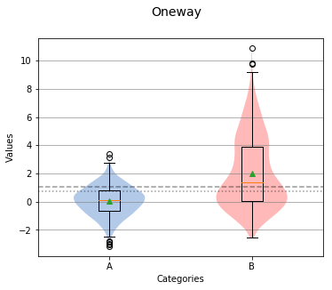
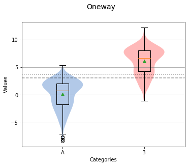
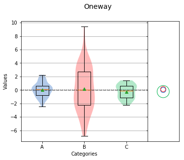
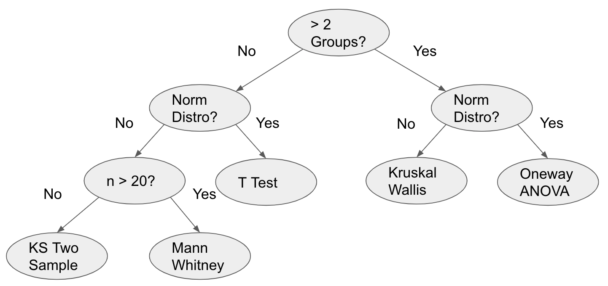
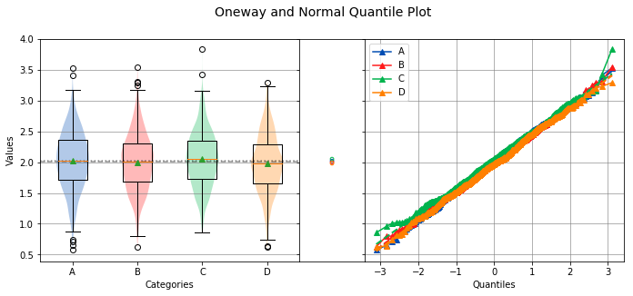
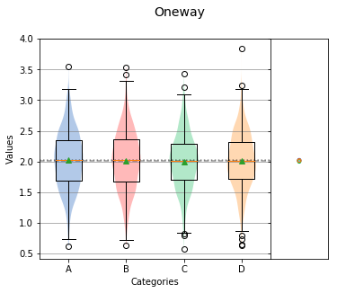
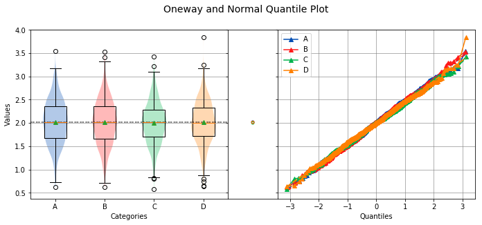
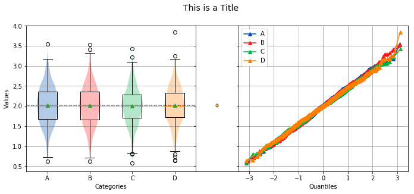
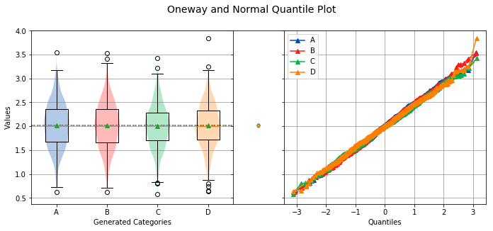
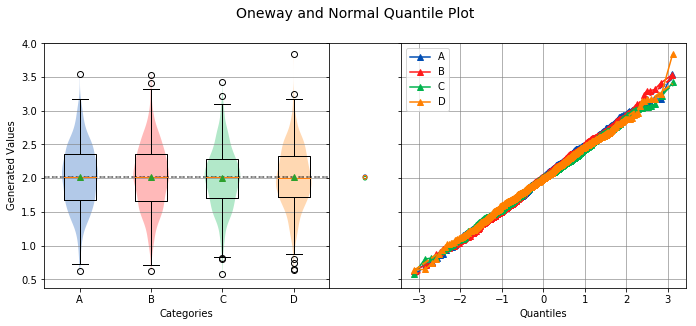

# Location Test

[Location testing](https://en.wikipedia.org/wiki/Location_test) is useful for comparing groups (also known as categories or treatments) of similar values to see if their locations are matched. In this case, location refers to a central value where all the values in a group have tendency to collect around. This is usually a [mean](https://en.wikipedia.org/wiki/Mean) or [median](https://en.wikipedia.org/wiki/Median) of the group.

The Location Test analysis actually performs two tests, one for comparing variances between groups, and the second for comparing the location between groups. Both are useful for determining how similar or dissimilar the distribution of the groups are compared to one another.

## Interpreting the Graphs

The graph produced by the Location Test produces three charts by default: [Boxplots](https://towardsdatascience.com/understanding-boxplots-5e2df7bcbd51), [Tukey-Kramer circles](https://docs.tibco.com/pub/spotfire/6.5.0/doc/html/box/box_comparison_circles_algorithm_.htm), and a [Normal Quantile plot](https://data.library.virginia.edu/understanding-q-q-plots/). Let's examine these individually.


```python


import numpy as np
import scipy.stats as st
from sci_analysis import analyze

%matplotlib inline
```

### The Boxplots

Boxplots in sci-analysis are actually a hybrid of two distribution visualization techniques, the boxplot and the [violin plot](https://en.wikipedia.org/wiki/Violin_plot). Boxplots are a good way to quickly understand a distribution, but can be misleading when the distribution is [multimodal](https://en.wikipedia.org/wiki/Multimodal_distribution). A violin plot does a much better job at showing the local maxima and minima of a distribution.


```python
np.random.seed(987654321)
a = st.norm.rvs(0, 1, 1000)
b = np.append(st.norm.rvs(4, 2, 500), st.norm.rvs(0, 1, 500))
analyze(
    {'A': a, 'B': b}, 
    circles=False, 
    nqp=False,
)
```





    
    
    Overall Statistics
    ------------------
    
    Number of Groups =  2
    Total            =  2000
    Grand Mean       =  1.0413
    Pooled Std Dev   =  1.9068
    Grand Median     =  0.7279
    
    
    Group Statistics
    ----------------
    
    n             Mean          Std Dev       Min           Median        Max           Group         
    --------------------------------------------------------------------------------------------------
    1000           0.0551        1.0287       -3.1586        0.0897        3.4087       A             
    1000           2.0275        2.4926       -2.5414        1.3661        10.8915      B             
    
    
    Levene Test
    -----------
    
    alpha   =  0.0500
    W value =  513.4363
    p value =  0.0000
    
    HA: Variances are not equal
    
    
    
    Mann Whitney U Test
    -------------------
    
    alpha   =  0.0500
    u value =  263634.0000
    p value =  0.0000
    
    HA: Locations are not matched
    


In the center of each box is a red line and green triangle. The green triangle represents the mean of the group while the red line represents the median, sometimes referred to as the second quartile (Q2) or 50% line.

The boxplot graph also shows a short dotted line and long dotted line that represent the grand median and [grand mean](https://en.wikipedia.org/wiki/Grand_mean) respectively.


```python
np.random.seed(987654321)
a = np.append(st.norm.rvs(2, 1, 500), st.norm.rvs(-2, 2, 500))
b = np.append(st.norm.rvs(8, 1, 500), st.norm.rvs(4, 2, 500))
analyze(
    {'A': a, 'B': b}, 
    circles=False, 
    nqp=False,
)
```





    
    
    Overall Statistics
    ------------------
    
    Number of Groups =  2
    Total            =  2000
    Grand Mean       =  3.0982
    Pooled Std Dev   =  2.4841
    Grand Median     =  3.7150
    
    
    Group Statistics
    ----------------
    
    n             Mean          Std Dev       Min           Median        Max           Group         
    --------------------------------------------------------------------------------------------------
    1000           0.0957        2.5307       -8.3172        0.7375        5.4087       A             
    1000           6.1006        2.4365       -1.0829        6.6925        12.1766      B             
    
    
    Levene Test
    -----------
    
    alpha   =  0.0500
    W value =  0.6238
    p value =  0.4297
    
    H0: Variances are equal
    
    
    
    Mann Whitney U Test
    -------------------
    
    alpha   =  0.0500
    u value =  43916.0000
    p value =  0.0000
    
    HA: Locations are not matched
    


### Tukey-Kramer Circles

Tukey-Kramer Circles, also referred to as comparison circles are based on the Tukey HSD test. Each circle is centered on the mean of each group and the radius of the circle is calculated from the mean standard error and size of the group. In this case, the radius is proportional to the standard error and inversely proportional to the size of the group. Therefore, a higher variation or smaller group size will produce a larger circle.


```python
np.random.seed(987654321)
a = st.norm.rvs(0, 1, 100)
b = st.norm.rvs(0, 3, 100)
c = st.norm.rvs(0, 1, 20)
analyze(
    {'A': a, 'B': b, 'C': c}, 
    nqp=False,
)
```





    
    
    Overall Statistics
    ------------------
    
    Number of Groups =  3
    Total            =  220
    Grand Mean       = -0.0286
    Pooled Std Dev   =  2.3353
    Grand Median     =  0.0394
    
    
    Group Statistics
    ----------------
    
    n             Mean          Std Dev       Min           Median        Max           Group         
    --------------------------------------------------------------------------------------------------
    100            0.0083        1.0641       -2.4718        0.0761        2.2466       A             
    100            0.1431        3.2552       -6.8034        0.0394        9.4199       B             
    20            -0.2373        1.0830       -2.2349       -0.1229        1.4290       C             
    
    
    Bartlett Test
    -------------
    
    alpha   =  0.0500
    T value =  117.7279
    p value =  0.0000
    
    HA: Variances are not equal
    
    
    
    Kruskal-Wallis
    --------------
    
    alpha   =  0.0500
    h value =  0.2997
    p value =  0.8608
    
    H0: Group means are matched
    


If circles of different groups are mostly overlapping, the means of those groups are likely matched. However, if circles are not touching each other or only partly overlap, the means of those groups are likely different.


```python
np.random.seed(987654321)
a = st.norm.rvs(0, 1, 50)
b = st.norm.rvs(0.1, 1, 50)
c = st.norm.rvs(1, 1, 20)
analyze(
    {'A': a, 'B': b, 'C': c}, 
    nqp=False,
)
```


    
    
    Overall Statistics
    ------------------
    
    Number of Groups =  3
    Total            =  120
    Grand Mean       =  0.3935
    Pooled Std Dev   =  1.0608
    Grand Median     =  0.3123
    
    
    Group Statistics
    ----------------
    
    n             Mean          Std Dev       Min           Median        Max           Group         
    --------------------------------------------------------------------------------------------------
    50            -0.0891        1.1473       -2.4036       -0.2490        2.2466       A             
    50             0.2057        0.9758       -2.3718        0.3123        1.8617       B             
    20             1.0637        1.0391       -0.9072        1.2480        2.8849       C             
    
    
    Bartlett Test
    -------------
    
    alpha   =  0.0500
    T value =  1.2811
    p value =  0.5270
    
    H0: Variances are equal
    
    
    
    Oneway ANOVA
    ------------
    
    alpha   =  0.0500
    f value =  8.4504
    p value =  0.0004
    
    HA: Group means are not matched
    


### Normal Quantile Plot

A Normal Quantile Plot is a specific type of [Quantile-Quantile (Q-Q) plot](https://en.wikipedia.org/wiki/Q–Q_plot) where the quantiles on the x-axis correspond to the quantiles of the normal distribution. In the case of the Normal Quantile Plot, one quantile corresponds to one [standard deviation](https://en.wikipedia.org/wiki/Standard_deviation). 

If the plotted points for a group on the Normal Quantile Plot closely resemble a straight line (regardless of slope), then the group is [normally distributed](https://en.wikipedia.org/wiki/Normal_distribution). In the example below, group C is not normally distributed, as seen by it's downward curved shape on the Normal Quantile Plot.


```python
np.random.seed(987654321)
a = st.norm.rvs(0, 1, size=50)
b = st.norm.rvs(0.1, 1, size=50)
c = st.weibull_max.rvs(0.95, size=50)
analyze(
    {'A': a, 'B': b, 'C': c}, 
    circles=False,
)
```


    
    
    Overall Statistics
    ------------------
    
    Number of Groups =  3
    Total            =  150
    Grand Mean       = -0.2507
    Pooled Std Dev   =  0.9868
    Grand Median     = -0.2490
    
    
    Group Statistics
    ----------------
    
    n             Mean          Std Dev       Min           Median        Max           Group         
    --------------------------------------------------------------------------------------------------
    50            -0.0891        1.1473       -2.4036       -0.2490        2.2466       A             
    50             0.2057        0.9758       -2.3718        0.3123        1.8617       B             
    50            -0.8687        0.8078       -3.7612       -0.6117       -0.0409       C             
    
    
    Levene Test
    -----------
    
    alpha   =  0.0500
    W value =  4.5142
    p value =  0.0125
    
    HA: Variances are not equal
    
    
    
    Kruskal-Wallis
    --------------
    
    alpha   =  0.0500
    h value =  28.3558
    p value =  0.0000
    
    HA: Group means are not matched
    


The slope of the data points on the Normal Quantile Plot indicate the relative variance of a particular group compared to the other groups.


```python
np.random.seed(987654321)
a = st.norm.rvs(0, 1, 50)
b = st.norm.rvs(0, 2, 50)
c = st.norm.rvs(0, 3, 50)
analyze(
    {'A': a, 'B': b, 'C': c}, 
    circles=False,
)
```


    
    
    Overall Statistics
    ------------------
    
    Number of Groups =  3
    Total            =  150
    Grand Mean       =  0.3013
    Pooled Std Dev   =  2.4717
    Grand Median     =  0.4247
    
    
    Group Statistics
    ----------------
    
    n             Mean          Std Dev       Min           Median        Max           Group         
    --------------------------------------------------------------------------------------------------
    50            -0.0891        1.1473       -2.4036       -0.2490        2.2466       A             
    50             0.2113        1.9515       -4.9435        0.4247        3.5233       B             
    50             0.7816        3.6335       -6.8034        1.3194        9.4199       C             
    
    
    Bartlett Test
    -------------
    
    alpha   =  0.0500
    T value =  60.0600
    p value =  0.0000
    
    HA: Variances are not equal
    
    
    
    Kruskal-Wallis
    --------------
    
    alpha   =  0.0500
    h value =  3.4335
    p value =  0.1796
    
    H0: Group means are matched
    


## Interpreting the Statistics

When performing a Location Test analysis, two statistics tables are given, the Overall Statistics and the Group Statistics.

The Overall Statistics shows the number of groups in the dataset, total number of data points in the dataset, Grand Mean, Grand Median, and [Pooled Standard Deviation](https://www.statisticshowto.datasciencecentral.com/pooled-standard-deviation/).

The Group Statistics list summary statistics for each group in a table. The summary statistics shown are the number of data points in the group (n), the Mean, Standard Deviation, Minimum, Median, Maximum, and group name.

The remaining two statistics are both [Hypothesis Tests](https://en.wikipedia.org/wiki/Statistical_hypothesis_testing). The first test attempts to determine if the variances of each group are matched or not. The second test attempts to determine if the locations of each group are matched or not. Each hypothesis test shows the [significance level](https://en.wikipedia.org/wiki/Statistical_significance) (alpha), test statistic, and [p-value](https://en.wikipedia.org/wiki/P-value). The hypothesis test used depends on a few different factors. The test for equal variance is fairly simple and depends on whether the all the data points in the dataset are normally distributed or not. If normally distributed, the [Bartlett Test](https://docs.scipy.org/doc/scipy/reference/generated/scipy.stats.bartlett.html#scipy.stats.bartlett) is used, otherwise the [Levene Test](https://docs.scipy.org/doc/scipy/reference/generated/scipy.stats.levene.html#scipy.stats.levene) is used.

The logic for determining which hypothesis test to use for checking location is more complex and depends on the number of groups, whether the data points in the dataset are normally distributed, and the size of the smallest group.



The five possible hypothesis tests from most sensitive to least sensitive are:
* [Oneway ANOVA](https://docs.scipy.org/doc/scipy/reference/generated/scipy.stats.f_oneway.html#scipy.stats.f_oneway)
* [Kruskal Wallis](https://docs.scipy.org/doc/scipy/reference/generated/scipy.stats.kruskal.html#scipy.stats.kruskal)
* [Student's T-Test](https://docs.scipy.org/doc/scipy/reference/generated/scipy.stats.ttest_ind.html#scipy.stats.ttest_ind)
* [Mann Whitney](https://docs.scipy.org/doc/scipy/reference/generated/scipy.stats.mannwhitneyu.html#scipy.stats.mannwhitneyu)
* [Kolmogorov-Smirnov Two Sample Test](https://docs.scipy.org/doc/scipy/reference/generated/scipy.stats.ks_2samp.html#scipy.stats.ks_2samp)

The last thing shown for each hypothesis test is the statement of the null hypothesis or alternative hypothesis. Each hypothesis has a null hypothesis that is assumed to be true. If the p-value of the test is lower than the significance level (alpha) of the test, the null hypothesis is rejected and the alternative hypothesis is stated. When the null hypothesis is rejected, it means that the likelihood of the outcome occurring by chance is significantly low enough that it is likely true.

Because the conclusion of hypothesis testing depends on an arbitrarily chosen significance level of 0.05, they should be taken with a bit of caution. This is why sci-analysis goes to lengths to try to use the most appropriate test given the supplied data and also pairs the test with graphs for a second source of truth.

## Usage

### Stacked Data
.. py:function:: analyze(sequence, groups[, nqp=True, circles=True, alpha=0.05, title='Oneway', categories='Categories', xname='Categories', name='Values', yname='Values', save_to=None])

    Performs a location test of numeric, stacked data.
    
    :param array-like sequence: The array-like object to analyze. It can be a list, tuple, numpy array or pandas Series of numeric values.
    :param array-like groups: An array-like of categorical values to group numeric values in *sequence* by. The values in groups correspond to the value at the same index in *sequence*. For this reason, the length of *sequence* and *groups* should be equal.
    :param bool nqp: Display the accompanying Normal Quantile Plot if **True**. The default value is **True**.
    :param bool circles: Display the Tukey-Kramer circles if **True**. The default value is **True**.
    :param float alpha: The significance level to use for hypothesis tests. The default value is 0.05.
    :param str title: The title of the graph.
    :param str categories: The label of the categories (groups) to be displayed along the x-axis of the graph.
    :param str xname: Alias for *categories*.
    :param str name: The label of the values in sequence to be displayed on the y-axis of the graph.
    :param str yname: Alias for *name*.
    :param str or None save_to: The path to the file where the graph will be saved.
### Unstacked Data
.. py:function:: analyze(sequences[, groups=None, nqp=True, circles=True, alpha=0.05, title='Oneway', categories='Categories', xname='Categories', name='Values', yname='Values', save_to=None])

    Performs a location test of numeric, unstacked data.
    
    :param array-like or dict sequences: The object to analyze. If *sequences* is a dictionary, the keys will be used as the group names and the *groups* argument will be ignored. If *sequences* is an array-like, its values should be array-likes for each group to analyze. If *groups* is **None**, numbers will automatically be assigned as category names for each array-like in *sequences*.
    :param list groups: A list of categories to group values in *sequences* by. The order of values in *groups* should match the array-like values in *sequences*.
    :param bool nqp: Display the accompanying Normal Quantile Plot if **True**. The default value is **True**.
    :param bool circles: Display the Tukey-Kramer circles if **True**. The default value is **True**.
    :param float alpha: The significance level to use for hypothesis tests. The default value is 0.05.
    :param str title: The title of the graph.
    :param str categories: The label of the categories (groups) to be displayed along the x-axis of the graph.
    :param str xname: Alias for categories.
    :param str name: The label of the values in sequence to be displayed on the y-axis of the graph.
    :param str yname: Alias for name.
    :param str or None save_to: The path to the file where the graph will be saved.
## Argument Examples

Let's first import sci-analysis and setup some variables to use in these examples.


```python
# Create sequence and groups from random variables for stacked data examples.
stacked = st.norm.rvs(2, 0.45, size=3000)
vals = 'ABCD'
stacked_groups = []
for _ in range(3000):
    stacked_groups.append(vals[np.random.randint(0, 4)])
```

### sequence, groups

When analyzing stacked data, both *sequence* and *groups* are required.


```python
analyze(
    stacked, 
    groups=stacked_groups,
)
```


    
    
    Overall Statistics
    ------------------
    
    Number of Groups =  4
    Total            =  3000
    Grand Mean       =  2.0118
    Pooled Std Dev   =  0.4558
    Grand Median     =  2.0174
    
    
    Group Statistics
    ----------------
    
    n             Mean          Std Dev       Min           Median        Max           Group         
    --------------------------------------------------------------------------------------------------
    720            2.0211        0.4667        0.6218        2.0240        3.5506       A             
    736            2.0126        0.4729        0.6281        2.0228        3.5339       B             
    782            1.9991        0.4403        0.5786        2.0120        3.4248       C             
    762            2.0143        0.4439        0.6396        2.0046        3.8397       D             
    
    
    Bartlett Test
    -------------
    
    alpha   =  0.0500
    T value =  5.7422
    p value =  0.1248
    
    H0: Variances are equal
    
    
    
    Oneway ANOVA
    ------------
    
    alpha   =  0.0500
    f value =  0.3117
    p value =  0.8169
    
    H0: Group means are matched
    


### sequences

When analyzing unstacked data, *sequences* can be a dictionary or an array-like of array-likes.


```python
# Create sequences from random variables for unstacked data examples.
np.random.seed(987654321)
a = st.norm.rvs(2, 0.45, size=750)
b = st.norm.rvs(2, 0.45, size=750)
c = st.norm.rvs(2, 0.45, size=750)
d = st.norm.rvs(2, 0.45, size=750)
```

If *sequences* is an array-like of array-likes, and *groups* is **None**, category labels will be automatically generated starting at 1.


```python
analyze([a, b, c, d])
```


    
    
    Overall Statistics
    ------------------
    
    Number of Groups =  4
    Total            =  3000
    Grand Mean       =  2.0149
    Pooled Std Dev   =  0.4564
    Grand Median     =  2.0219
    
    
    Group Statistics
    ----------------
    
    n             Mean          Std Dev       Min           Median        Max           Group         
    --------------------------------------------------------------------------------------------------
    750            2.0234        0.4679        0.5786        2.0328        3.5339       1             
    750            2.0006        0.4553        0.6281        2.0110        3.5506       2             
    750            2.0538        0.4446        0.8564        2.0512        3.8397       3             
    750            1.9819        0.4575        0.6218        1.9780        3.2952       4             
    
    
    Bartlett Test
    -------------
    
    alpha   =  0.0500
    T value =  1.9719
    p value =  0.5783
    
    H0: Variances are equal
    
    
    
    Oneway ANOVA
    ------------
    
    alpha   =  0.0500
    f value =  3.4508
    p value =  0.0159
    
    HA: Group means are not matched
    


If *sequences* is a dictionary, the keys will be used as category labels.
.. note:: When *sequences* is a dictionary, the categories will not necessarily be shown in order.


```python
analyze({'A': a, 'B': b, 'C': c, 'D': d})
```





    
    
    Overall Statistics
    ------------------
    
    Number of Groups =  4
    Total            =  3000
    Grand Mean       =  2.0149
    Pooled Std Dev   =  0.4564
    Grand Median     =  2.0219
    
    
    Group Statistics
    ----------------
    
    n             Mean          Std Dev       Min           Median        Max           Group         
    --------------------------------------------------------------------------------------------------
    750            2.0234        0.4679        0.5786        2.0328        3.5339       A             
    750            2.0006        0.4553        0.6281        2.0110        3.5506       B             
    750            2.0538        0.4446        0.8564        2.0512        3.8397       C             
    750            1.9819        0.4575        0.6218        1.9780        3.2952       D             
    
    
    Bartlett Test
    -------------
    
    alpha   =  0.0500
    T value =  1.9719
    p value =  0.5783
    
    H0: Variances are equal
    
    
    
    Oneway ANOVA
    ------------
    
    alpha   =  0.0500
    f value =  3.4508
    p value =  0.0159
    
    HA: Group means are not matched
    


### groups

If analyzing stacked data, *groups* should be an array-like with the same length as *sequence*. If analyzing unstacked data, *groups* should be the same length as *sequences* and all values in l*groups* should be unique.


```python
analyze(
    [a, b, c, d], 
    groups=['A', 'B', 'C', 'D'],
)
```


    
    
    Overall Statistics
    ------------------
    
    Number of Groups =  4
    Total            =  3000
    Grand Mean       =  2.0149
    Pooled Std Dev   =  0.4564
    Grand Median     =  2.0219
    
    
    Group Statistics
    ----------------
    
    n             Mean          Std Dev       Min           Median        Max           Group         
    --------------------------------------------------------------------------------------------------
    750            2.0234        0.4679        0.5786        2.0328        3.5339       A             
    750            2.0006        0.4553        0.6281        2.0110        3.5506       B             
    750            2.0538        0.4446        0.8564        2.0512        3.8397       C             
    750            1.9819        0.4575        0.6218        1.9780        3.2952       D             
    
    
    Bartlett Test
    -------------
    
    alpha   =  0.0500
    T value =  1.9719
    p value =  0.5783
    
    H0: Variances are equal
    
    
    
    Oneway ANOVA
    ------------
    
    alpha   =  0.0500
    f value =  3.4508
    p value =  0.0159
    
    HA: Group means are not matched
    


### nqp

Controls whether the Normal Quantile Plot is displayed or not. The default value is **True**.


```python
analyze(
    stacked, 
    groups=stacked_groups, 
    nqp=False,
)
```





    
    
    Overall Statistics
    ------------------
    
    Number of Groups =  4
    Total            =  3000
    Grand Mean       =  2.0118
    Pooled Std Dev   =  0.4558
    Grand Median     =  2.0174
    
    
    Group Statistics
    ----------------
    
    n             Mean          Std Dev       Min           Median        Max           Group         
    --------------------------------------------------------------------------------------------------
    720            2.0211        0.4667        0.6218        2.0240        3.5506       A             
    736            2.0126        0.4729        0.6281        2.0228        3.5339       B             
    782            1.9991        0.4403        0.5786        2.0120        3.4248       C             
    762            2.0143        0.4439        0.6396        2.0046        3.8397       D             
    
    
    Bartlett Test
    -------------
    
    alpha   =  0.0500
    T value =  5.7422
    p value =  0.1248
    
    H0: Variances are equal
    
    
    
    Oneway ANOVA
    ------------
    
    alpha   =  0.0500
    f value =  0.3117
    p value =  0.8169
    
    H0: Group means are matched
    


### circles

Controls whether the Tukey-Kramer circles are displayed or not. The default value is **True**.


```python
analyze(
    stacked, 
    groups=stacked_groups, 
    circles=False,
)
```


    
    
    Overall Statistics
    ------------------
    
    Number of Groups =  4
    Total            =  3000
    Grand Mean       =  2.0118
    Pooled Std Dev   =  0.4558
    Grand Median     =  2.0174
    
    
    Group Statistics
    ----------------
    
    n             Mean          Std Dev       Min           Median        Max           Group         
    --------------------------------------------------------------------------------------------------
    720            2.0211        0.4667        0.6218        2.0240        3.5506       A             
    736            2.0126        0.4729        0.6281        2.0228        3.5339       B             
    782            1.9991        0.4403        0.5786        2.0120        3.4248       C             
    762            2.0143        0.4439        0.6396        2.0046        3.8397       D             
    
    
    Bartlett Test
    -------------
    
    alpha   =  0.0500
    T value =  5.7422
    p value =  0.1248
    
    H0: Variances are equal
    
    
    
    Oneway ANOVA
    ------------
    
    alpha   =  0.0500
    f value =  0.3117
    p value =  0.8169
    
    H0: Group means are matched
    


### alpha

Sets the significance level to use for hypothesis testing.


```python
analyze(
    stacked, 
    groups=stacked_groups, 
    alpha=0.01,
)
```





    
    
    Overall Statistics
    ------------------
    
    Number of Groups =  4
    Total            =  3000
    Grand Mean       =  2.0118
    Pooled Std Dev   =  0.4558
    Grand Median     =  2.0174
    
    
    Group Statistics
    ----------------
    
    n             Mean          Std Dev       Min           Median        Max           Group         
    --------------------------------------------------------------------------------------------------
    720            2.0211        0.4667        0.6218        2.0240        3.5506       A             
    736            2.0126        0.4729        0.6281        2.0228        3.5339       B             
    782            1.9991        0.4403        0.5786        2.0120        3.4248       C             
    762            2.0143        0.4439        0.6396        2.0046        3.8397       D             
    
    
    Bartlett Test
    -------------
    
    alpha   =  0.0100
    T value =  5.7422
    p value =  0.1248
    
    H0: Variances are equal
    
    
    
    Oneway ANOVA
    ------------
    
    alpha   =  0.0100
    f value =  0.3117
    p value =  0.8169
    
    H0: Group means are matched
    


### title

The title of the distribution to display above the graph.


```python
analyze(
    stacked, 
    groups=stacked_groups, 
    title='This is a Title',
)
```





    
    
    Overall Statistics
    ------------------
    
    Number of Groups =  4
    Total            =  3000
    Grand Mean       =  2.0118
    Pooled Std Dev   =  0.4558
    Grand Median     =  2.0174
    
    
    Group Statistics
    ----------------
    
    n             Mean          Std Dev       Min           Median        Max           Group         
    --------------------------------------------------------------------------------------------------
    720            2.0211        0.4667        0.6218        2.0240        3.5506       A             
    736            2.0126        0.4729        0.6281        2.0228        3.5339       B             
    782            1.9991        0.4403        0.5786        2.0120        3.4248       C             
    762            2.0143        0.4439        0.6396        2.0046        3.8397       D             
    
    
    Bartlett Test
    -------------
    
    alpha   =  0.0500
    T value =  5.7422
    p value =  0.1248
    
    H0: Variances are equal
    
    
    
    Oneway ANOVA
    ------------
    
    alpha   =  0.0500
    f value =  0.3117
    p value =  0.8169
    
    H0: Group means are matched
    


### categories, xname

The name of the category labels to display on the x-axis.


```python
analyze(
    stacked, 
    groups=stacked_groups, 
    categories='Generated Categories',
)
```


    
    
    Overall Statistics
    ------------------
    
    Number of Groups =  4
    Total            =  3000
    Grand Mean       =  2.0118
    Pooled Std Dev   =  0.4558
    Grand Median     =  2.0174
    
    
    Group Statistics
    ----------------
    
    n             Mean          Std Dev       Min           Median        Max           Group         
    --------------------------------------------------------------------------------------------------
    720            2.0211        0.4667        0.6218        2.0240        3.5506       A             
    736            2.0126        0.4729        0.6281        2.0228        3.5339       B             
    782            1.9991        0.4403        0.5786        2.0120        3.4248       C             
    762            2.0143        0.4439        0.6396        2.0046        3.8397       D             
    
    
    Bartlett Test
    -------------
    
    alpha   =  0.0500
    T value =  5.7422
    p value =  0.1248
    
    H0: Variances are equal
    
    
    
    Oneway ANOVA
    ------------
    
    alpha   =  0.0500
    f value =  0.3117
    p value =  0.8169
    
    H0: Group means are matched
    


```python
analyze(
    stacked, 
    groups=stacked_groups, 
    xname='Generated Categories',
)
```





    
    
    Overall Statistics
    ------------------
    
    Number of Groups =  4
    Total            =  3000
    Grand Mean       =  2.0118
    Pooled Std Dev   =  0.4558
    Grand Median     =  2.0174
    
    
    Group Statistics
    ----------------
    
    n             Mean          Std Dev       Min           Median        Max           Group         
    --------------------------------------------------------------------------------------------------
    720            2.0211        0.4667        0.6218        2.0240        3.5506       A             
    736            2.0126        0.4729        0.6281        2.0228        3.5339       B             
    782            1.9991        0.4403        0.5786        2.0120        3.4248       C             
    762            2.0143        0.4439        0.6396        2.0046        3.8397       D             
    
    
    Bartlett Test
    -------------
    
    alpha   =  0.0500
    T value =  5.7422
    p value =  0.1248
    
    H0: Variances are equal
    
    
    
    Oneway ANOVA
    ------------
    
    alpha   =  0.0500
    f value =  0.3117
    p value =  0.8169
    
    H0: Group means are matched
    


### name, yname

The label to display on the y-axis.


```python
analyze(
    stacked, 
    groups=stacked_groups, 
    name='Generated Values',
)
```


    
    
    Overall Statistics
    ------------------
    
    Number of Groups =  4
    Total            =  3000
    Grand Mean       =  2.0118
    Pooled Std Dev   =  0.4558
    Grand Median     =  2.0174
    
    
    Group Statistics
    ----------------
    
    n             Mean          Std Dev       Min           Median        Max           Group         
    --------------------------------------------------------------------------------------------------
    720            2.0211        0.4667        0.6218        2.0240        3.5506       A             
    736            2.0126        0.4729        0.6281        2.0228        3.5339       B             
    782            1.9991        0.4403        0.5786        2.0120        3.4248       C             
    762            2.0143        0.4439        0.6396        2.0046        3.8397       D             
    
    
    Bartlett Test
    -------------
    
    alpha   =  0.0500
    T value =  5.7422
    p value =  0.1248
    
    H0: Variances are equal
    
    
    
    Oneway ANOVA
    ------------
    
    alpha   =  0.0500
    f value =  0.3117
    p value =  0.8169
    
    H0: Group means are matched
    


```python
analyze(
    stacked, 
    groups=stacked_groups, 
    yname='Generated Values',
)
```





    
    
    Overall Statistics
    ------------------
    
    Number of Groups =  4
    Total            =  3000
    Grand Mean       =  2.0118
    Pooled Std Dev   =  0.4558
    Grand Median     =  2.0174
    
    
    Group Statistics
    ----------------
    
    n             Mean          Std Dev       Min           Median        Max           Group         
    --------------------------------------------------------------------------------------------------
    720            2.0211        0.4667        0.6218        2.0240        3.5506       A             
    736            2.0126        0.4729        0.6281        2.0228        3.5339       B             
    782            1.9991        0.4403        0.5786        2.0120        3.4248       C             
    762            2.0143        0.4439        0.6396        2.0046        3.8397       D             
    
    
    Bartlett Test
    -------------
    
    alpha   =  0.0500
    T value =  5.7422
    p value =  0.1248
    
    H0: Variances are equal
    
    
    
    Oneway ANOVA
    ------------
    
    alpha   =  0.0500
    f value =  0.3117
    p value =  0.8169
    
    H0: Group means are matched
    

