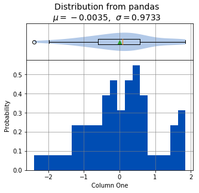
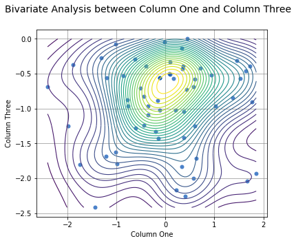
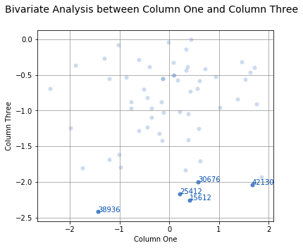
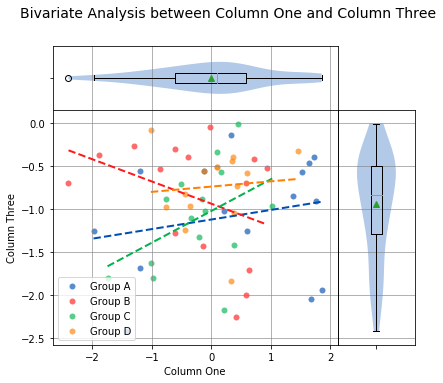
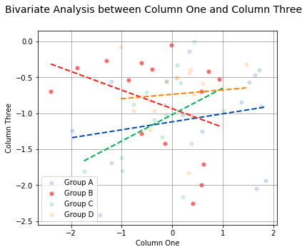
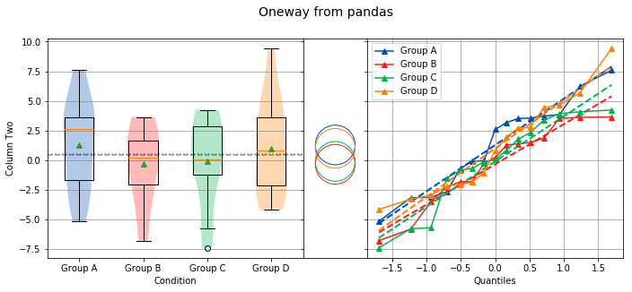
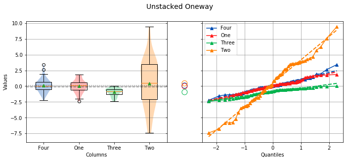
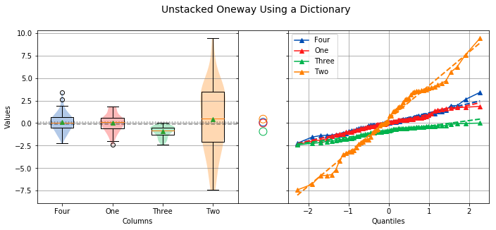
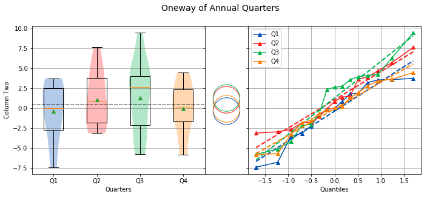

# Using sci-analysis with pandas

Pandas is a python package that simplifies working with tabular or relational data. Because columns and rows of data in a pandas DataFrame are naturally array-like, using pandas with sci-analysis is the preferred way to use sci-analysis.

Let's create a pandas DataFrame to use for analysis:


```python


%matplotlib inline
import numpy as np
import scipy.stats as st
from sci_analysis import analyze
```


```python
import pandas as pd
np.random.seed(987654321)
df = pd.DataFrame(
    {
        'ID'        : np.random.randint(10000, 50000, size=60).astype(str),
        'One'       : st.norm.rvs(0.0, 1, size=60),
        'Two'       : st.norm.rvs(0.0, 3, size=60),
        'Three'     : st.weibull_max.rvs(1.2, size=60),
        'Four'      : st.norm.rvs(0.0, 1, size=60),
        'Month'     : ['Jan', 'Feb', 'Mar', 'Apr', 'May', 'Jun', 'Jul', 'Aug', 'Sep', 'Oct', 'Nov', 'Dec'] * 5,
        'Condition' : ['Group A', 'Group B', 'Group C', 'Group D'] * 15
    }
)
df
```


<div>
<style scoped>
    .dataframe tbody tr th:only-of-type {
        vertical-align: middle;
    }

    .dataframe tbody tr th {
        vertical-align: top;
    }

    .dataframe thead th {
        text-align: right;
    }
</style>
<table border="1" class="dataframe">
  <thead>
    <tr style="text-align: right;">
      <th></th>
      <th>ID</th>
      <th>One</th>
      <th>Two</th>
      <th>Three</th>
      <th>Four</th>
      <th>Month</th>
      <th>Condition</th>
    </tr>
  </thead>
  <tbody>
    <tr>
      <th>0</th>
      <td>33815</td>
      <td>-1.199973</td>
      <td>-0.051015</td>
      <td>-0.556609</td>
      <td>-1.145177</td>
      <td>Jan</td>
      <td>Group A</td>
    </tr>
    <tr>
      <th>1</th>
      <td>49378</td>
      <td>-0.142682</td>
      <td>3.522920</td>
      <td>-1.424446</td>
      <td>-0.880138</td>
      <td>Feb</td>
      <td>Group B</td>
    </tr>
    <tr>
      <th>2</th>
      <td>21015</td>
      <td>-1.746777</td>
      <td>-7.415294</td>
      <td>-1.804494</td>
      <td>-0.487270</td>
      <td>Mar</td>
      <td>Group C</td>
    </tr>
    <tr>
      <th>3</th>
      <td>15552</td>
      <td>-0.437626</td>
      <td>0.805884</td>
      <td>-1.235840</td>
      <td>0.416363</td>
      <td>Apr</td>
      <td>Group D</td>
    </tr>
    <tr>
      <th>4</th>
      <td>38833</td>
      <td>-1.205166</td>
      <td>-0.105672</td>
      <td>-1.683723</td>
      <td>-0.151296</td>
      <td>May</td>
      <td>Group A</td>
    </tr>
    <tr>
      <th>5</th>
      <td>13561</td>
      <td>-0.610066</td>
      <td>-1.842630</td>
      <td>-1.280547</td>
      <td>0.645674</td>
      <td>Jun</td>
      <td>Group B</td>
    </tr>
    <tr>
      <th>6</th>
      <td>36967</td>
      <td>-0.203453</td>
      <td>2.323542</td>
      <td>-1.326379</td>
      <td>1.014516</td>
      <td>Jul</td>
      <td>Group C</td>
    </tr>
    <tr>
      <th>7</th>
      <td>43379</td>
      <td>0.085310</td>
      <td>-2.053241</td>
      <td>-0.503970</td>
      <td>-1.349427</td>
      <td>Aug</td>
      <td>Group D</td>
    </tr>
    <tr>
      <th>8</th>
      <td>36113</td>
      <td>1.853726</td>
      <td>-5.176661</td>
      <td>-1.935414</td>
      <td>0.513536</td>
      <td>Sep</td>
      <td>Group A</td>
    </tr>
    <tr>
      <th>9</th>
      <td>18422</td>
      <td>-0.614827</td>
      <td>1.266392</td>
      <td>-0.292610</td>
      <td>-2.234853</td>
      <td>Oct</td>
      <td>Group B</td>
    </tr>
    <tr>
      <th>10</th>
      <td>24986</td>
      <td>0.091151</td>
      <td>-5.721601</td>
      <td>-0.330216</td>
      <td>1.269432</td>
      <td>Nov</td>
      <td>Group C</td>
    </tr>
    <tr>
      <th>11</th>
      <td>27743</td>
      <td>0.367027</td>
      <td>1.929861</td>
      <td>-0.388752</td>
      <td>-0.807231</td>
      <td>Dec</td>
      <td>Group D</td>
    </tr>
    <tr>
      <th>12</th>
      <td>29620</td>
      <td>0.337290</td>
      <td>3.160379</td>
      <td>-0.139480</td>
      <td>0.917287</td>
      <td>Jan</td>
      <td>Group A</td>
    </tr>
    <tr>
      <th>13</th>
      <td>16982</td>
      <td>-2.403575</td>
      <td>1.846666</td>
      <td>-0.689486</td>
      <td>-0.406160</td>
      <td>Feb</td>
      <td>Group B</td>
    </tr>
    <tr>
      <th>14</th>
      <td>49184</td>
      <td>-1.008465</td>
      <td>-0.148862</td>
      <td>-1.620799</td>
      <td>0.707101</td>
      <td>Mar</td>
      <td>Group C</td>
    </tr>
    <tr>
      <th>15</th>
      <td>35850</td>
      <td>-0.352184</td>
      <td>5.654610</td>
      <td>-0.966809</td>
      <td>0.927546</td>
      <td>Apr</td>
      <td>Group D</td>
    </tr>
    <tr>
      <th>16</th>
      <td>47386</td>
      <td>0.598030</td>
      <td>-2.689915</td>
      <td>-1.253860</td>
      <td>0.570852</td>
      <td>May</td>
      <td>Group A</td>
    </tr>
    <tr>
      <th>17</th>
      <td>19963</td>
      <td>0.573027</td>
      <td>1.372438</td>
      <td>-0.690340</td>
      <td>-0.798698</td>
      <td>Jun</td>
      <td>Group B</td>
    </tr>
    <tr>
      <th>18</th>
      <td>25412</td>
      <td>0.215652</td>
      <td>4.065310</td>
      <td>-2.168703</td>
      <td>-1.567035</td>
      <td>Jul</td>
      <td>Group C</td>
    </tr>
    <tr>
      <th>19</th>
      <td>38630</td>
      <td>-0.436220</td>
      <td>-2.193357</td>
      <td>-0.821331</td>
      <td>0.071891</td>
      <td>Aug</td>
      <td>Group D</td>
    </tr>
    <tr>
      <th>20</th>
      <td>29330</td>
      <td>0.209028</td>
      <td>-0.720595</td>
      <td>-1.019263</td>
      <td>0.798486</td>
      <td>Sep</td>
      <td>Group A</td>
    </tr>
    <tr>
      <th>21</th>
      <td>15612</td>
      <td>0.406017</td>
      <td>0.221715</td>
      <td>-2.252922</td>
      <td>-0.006731</td>
      <td>Oct</td>
      <td>Group B</td>
    </tr>
    <tr>
      <th>22</th>
      <td>42431</td>
      <td>-0.112333</td>
      <td>3.377393</td>
      <td>-1.023559</td>
      <td>0.813721</td>
      <td>Nov</td>
      <td>Group C</td>
    </tr>
    <tr>
      <th>23</th>
      <td>38265</td>
      <td>0.341139</td>
      <td>2.775356</td>
      <td>-0.434224</td>
      <td>3.408679</td>
      <td>Dec</td>
      <td>Group D</td>
    </tr>
    <tr>
      <th>24</th>
      <td>38936</td>
      <td>-1.435777</td>
      <td>-3.183457</td>
      <td>-2.417681</td>
      <td>0.994073</td>
      <td>Jan</td>
      <td>Group A</td>
    </tr>
    <tr>
      <th>25</th>
      <td>22402</td>
      <td>0.719249</td>
      <td>-2.281663</td>
      <td>-0.419681</td>
      <td>0.025585</td>
      <td>Feb</td>
      <td>Group B</td>
    </tr>
    <tr>
      <th>26</th>
      <td>10490</td>
      <td>1.022446</td>
      <td>-0.884773</td>
      <td>-0.962212</td>
      <td>0.532781</td>
      <td>Mar</td>
      <td>Group C</td>
    </tr>
    <tr>
      <th>27</th>
      <td>15452</td>
      <td>1.463633</td>
      <td>-1.052140</td>
      <td>-0.316955</td>
      <td>0.135338</td>
      <td>Apr</td>
      <td>Group D</td>
    </tr>
    <tr>
      <th>28</th>
      <td>20401</td>
      <td>1.375250</td>
      <td>-3.150916</td>
      <td>-0.842319</td>
      <td>1.060090</td>
      <td>May</td>
      <td>Group A</td>
    </tr>
    <tr>
      <th>29</th>
      <td>24927</td>
      <td>-1.885277</td>
      <td>-1.824083</td>
      <td>-0.368665</td>
      <td>-0.636261</td>
      <td>Jun</td>
      <td>Group B</td>
    </tr>
    <tr>
      <th>30</th>
      <td>27535</td>
      <td>0.379140</td>
      <td>4.224249</td>
      <td>-1.415238</td>
      <td>1.940782</td>
      <td>Jul</td>
      <td>Group C</td>
    </tr>
    <tr>
      <th>31</th>
      <td>28809</td>
      <td>0.427183</td>
      <td>9.419918</td>
      <td>-0.730669</td>
      <td>-1.345587</td>
      <td>Aug</td>
      <td>Group D</td>
    </tr>
    <tr>
      <th>32</th>
      <td>42130</td>
      <td>1.671549</td>
      <td>3.501617</td>
      <td>-2.043236</td>
      <td>1.939640</td>
      <td>Sep</td>
      <td>Group A</td>
    </tr>
    <tr>
      <th>33</th>
      <td>43074</td>
      <td>0.933478</td>
      <td>-0.262629</td>
      <td>-0.523070</td>
      <td>-0.551311</td>
      <td>Oct</td>
      <td>Group B</td>
    </tr>
    <tr>
      <th>34</th>
      <td>37342</td>
      <td>-0.986482</td>
      <td>-1.544095</td>
      <td>-1.795220</td>
      <td>-0.523349</td>
      <td>Nov</td>
      <td>Group C</td>
    </tr>
    <tr>
      <th>35</th>
      <td>16932</td>
      <td>-0.121223</td>
      <td>4.431819</td>
      <td>-0.554931</td>
      <td>-1.387899</td>
      <td>Dec</td>
      <td>Group D</td>
    </tr>
    <tr>
      <th>36</th>
      <td>46045</td>
      <td>-0.121785</td>
      <td>3.704645</td>
      <td>-0.555530</td>
      <td>-0.610390</td>
      <td>Jan</td>
      <td>Group A</td>
    </tr>
    <tr>
      <th>37</th>
      <td>13717</td>
      <td>-1.303516</td>
      <td>-3.525625</td>
      <td>-0.268351</td>
      <td>0.220075</td>
      <td>Feb</td>
      <td>Group B</td>
    </tr>
    <tr>
      <th>38</th>
      <td>26979</td>
      <td>0.167418</td>
      <td>1.754883</td>
      <td>-0.570240</td>
      <td>-0.258519</td>
      <td>Mar</td>
      <td>Group C</td>
    </tr>
    <tr>
      <th>39</th>
      <td>32178</td>
      <td>0.379428</td>
      <td>-2.980751</td>
      <td>-1.046118</td>
      <td>-1.266934</td>
      <td>Apr</td>
      <td>Group D</td>
    </tr>
    <tr>
      <th>40</th>
      <td>22586</td>
      <td>1.528444</td>
      <td>3.847906</td>
      <td>-0.564254</td>
      <td>0.168995</td>
      <td>May</td>
      <td>Group A</td>
    </tr>
    <tr>
      <th>41</th>
      <td>30676</td>
      <td>0.579101</td>
      <td>1.481665</td>
      <td>-2.000617</td>
      <td>-1.136057</td>
      <td>Jun</td>
      <td>Group B</td>
    </tr>
    <tr>
      <th>42</th>
      <td>12145</td>
      <td>-0.512085</td>
      <td>-5.800311</td>
      <td>-0.703269</td>
      <td>1.309943</td>
      <td>Jul</td>
      <td>Group C</td>
    </tr>
    <tr>
      <th>43</th>
      <td>33851</td>
      <td>0.329299</td>
      <td>-4.168787</td>
      <td>-1.832158</td>
      <td>2.626034</td>
      <td>Aug</td>
      <td>Group D</td>
    </tr>
    <tr>
      <th>44</th>
      <td>20004</td>
      <td>1.761672</td>
      <td>6.218044</td>
      <td>-0.903584</td>
      <td>0.052300</td>
      <td>Sep</td>
      <td>Group A</td>
    </tr>
    <tr>
      <th>45</th>
      <td>48903</td>
      <td>-0.391426</td>
      <td>3.600225</td>
      <td>-0.390644</td>
      <td>-1.282138</td>
      <td>Oct</td>
      <td>Group B</td>
    </tr>
    <tr>
      <th>46</th>
      <td>11760</td>
      <td>-0.153558</td>
      <td>0.022388</td>
      <td>-0.882584</td>
      <td>0.461477</td>
      <td>Nov</td>
      <td>Group C</td>
    </tr>
    <tr>
      <th>47</th>
      <td>21061</td>
      <td>-0.765411</td>
      <td>-1.856080</td>
      <td>-0.967070</td>
      <td>-0.169594</td>
      <td>Dec</td>
      <td>Group D</td>
    </tr>
    <tr>
      <th>48</th>
      <td>18232</td>
      <td>-1.983058</td>
      <td>3.544743</td>
      <td>-1.246127</td>
      <td>1.408816</td>
      <td>Jan</td>
      <td>Group A</td>
    </tr>
    <tr>
      <th>49</th>
      <td>29927</td>
      <td>-0.017905</td>
      <td>-6.803385</td>
      <td>-0.043450</td>
      <td>-0.192027</td>
      <td>Feb</td>
      <td>Group B</td>
    </tr>
    <tr>
      <th>50</th>
      <td>30740</td>
      <td>-0.772090</td>
      <td>0.826426</td>
      <td>-0.875306</td>
      <td>0.074382</td>
      <td>Mar</td>
      <td>Group C</td>
    </tr>
    <tr>
      <th>51</th>
      <td>41741</td>
      <td>-1.017919</td>
      <td>4.670395</td>
      <td>-0.080428</td>
      <td>0.408054</td>
      <td>Apr</td>
      <td>Group D</td>
    </tr>
    <tr>
      <th>52</th>
      <td>45287</td>
      <td>1.721927</td>
      <td>7.581574</td>
      <td>-0.395787</td>
      <td>0.114241</td>
      <td>May</td>
      <td>Group A</td>
    </tr>
    <tr>
      <th>53</th>
      <td>39581</td>
      <td>-0.860012</td>
      <td>3.638375</td>
      <td>-0.530987</td>
      <td>0.019394</td>
      <td>Jun</td>
      <td>Group B</td>
    </tr>
    <tr>
      <th>54</th>
      <td>19179</td>
      <td>0.441536</td>
      <td>3.921498</td>
      <td>-0.001505</td>
      <td>0.373191</td>
      <td>Jul</td>
      <td>Group C</td>
    </tr>
    <tr>
      <th>55</th>
      <td>17116</td>
      <td>0.604572</td>
      <td>2.716440</td>
      <td>-0.580509</td>
      <td>-0.157461</td>
      <td>Aug</td>
      <td>Group D</td>
    </tr>
    <tr>
      <th>56</th>
      <td>34913</td>
      <td>1.635415</td>
      <td>2.587376</td>
      <td>-0.463056</td>
      <td>-0.189674</td>
      <td>Sep</td>
      <td>Group A</td>
    </tr>
    <tr>
      <th>57</th>
      <td>13794</td>
      <td>0.623878</td>
      <td>-5.834247</td>
      <td>-1.710010</td>
      <td>-0.232304</td>
      <td>Oct</td>
      <td>Group B</td>
    </tr>
    <tr>
      <th>58</th>
      <td>28453</td>
      <td>-0.349846</td>
      <td>-0.703319</td>
      <td>-1.094846</td>
      <td>-0.238145</td>
      <td>Nov</td>
      <td>Group C</td>
    </tr>
    <tr>
      <th>59</th>
      <td>25158</td>
      <td>0.097128</td>
      <td>-3.303646</td>
      <td>-0.508852</td>
      <td>0.112469</td>
      <td>Dec</td>
      <td>Group D</td>
    </tr>
  </tbody>
</table>
</div>


This creates a table (pandas DataFrame object) with 6 columns and an index which is the row id. The following command can be used to analyze the distribution of the column titled **One**:


```python
analyze(
    df['One'], 
    name='Column One', 
    title='Distribution from pandas'
)
```





    
    
    Statistics
    ----------
    
    n         =  60
    Mean      = -0.0035
    Std Dev   =  0.9733
    Std Error =  0.1257
    Skewness  = -0.1472
    Kurtosis  = -0.2412
    Maximum   =  1.8537
    75%       =  0.5745
    50%       =  0.0882
    25%       = -0.6113
    Minimum   = -2.4036
    IQR       =  1.1858
    Range     =  4.2573
    
    
    Shapiro-Wilk test for normality
    -------------------------------
    
    alpha   =  0.0500
    W value =  0.9804
    p value =  0.4460
    
    H0: Data is normally distributed
    


Anywhere you use a python list or numpy Array in sci-analysis, you can use a column or row of a pandas DataFrame (known in pandas terms as a Series). This is because a pandas Series has much of the same behavior as a numpy Array, causing sci-analysis to handle a pandas Series as if it were a numpy Array.

By passing two array-like arguments to the ``analyze()`` function, the correlation can be determined between the two array-like arguments. The following command can be used to analyze the correlation between columns **One** and **Three**:


```python
analyze(
    df['One'], 
    df['Three'], 
    xname='Column One', 
    yname='Column Three', 
    title='Bivariate Analysis between Column One and Column Three'
)
```


    
    
    Linear Regression
    -----------------
    
    n         =  60
    Slope     =  0.0281
    Intercept = -0.9407
    r         =  0.0449
    r^2       =  0.0020
    Std Err   =  0.0820
    p value   =  0.7332
    
    
    
    Spearman Correlation Coefficient
    --------------------------------
    
    alpha   =  0.0500
    r value =  0.0316
    p value =  0.8105
    
    H0: There is no significant relationship between predictor and response
    


Since there isn't a correlation between columns **One** and **Three**, it might be useful to see where most of the data is concentrated. This can be done by adding the argument ``contours=True`` and turning off the best fit line with ``fit=False``. For example:


```python
analyze(
    df['One'], 
    df['Three'], 
    xname='Column One', 
    yname='Column Three',
    contours=True,
    fit=False,
    title='Bivariate Analysis between Column One and Column Three'
)
```





    
    
    Linear Regression
    -----------------
    
    n         =  60
    Slope     =  0.0281
    Intercept = -0.9407
    r         =  0.0449
    r^2       =  0.0020
    Std Err   =  0.0820
    p value   =  0.7332
    
    
    
    Spearman Correlation Coefficient
    --------------------------------
    
    alpha   =  0.0500
    r value =  0.0316
    p value =  0.8105
    
    H0: There is no significant relationship between predictor and response
    


With a few point below -2.0, it might be useful to know which data point they are. This can be done by passing the **ID** column to the `labels` argument and then selecting which labels to highlight with the `highlight` argument: 


```python
analyze(
    df['One'], 
    df['Three'], 
    labels=df['ID'],
    highlight=df[df['Three'] < -2.0]['ID'],
    fit=False,
    xname='Column One', 
    yname='Column Three', 
    title='Bivariate Analysis between Column One and Column Three'
)
```





    
    
    Linear Regression
    -----------------
    
    n         =  60
    Slope     =  0.0281
    Intercept = -0.9407
    r         =  0.0449
    r^2       =  0.0020
    Std Err   =  0.0820
    p value   =  0.7332
    
    
    
    Spearman Correlation Coefficient
    --------------------------------
    
    alpha   =  0.0500
    r value =  0.0316
    p value =  0.8105
    
    H0: There is no significant relationship between predictor and response
    


To check whether an individual **Condition** correlates between Column **One** and Column **Three**, the same analysis can be done, but this time by passing the **Condition** column to the groups argument. For example:


```python
analyze(
    df['One'], 
    df['Three'],
    xname='Column One',
    yname='Column Three',
    groups=df['Condition'],
    title='Bivariate Analysis between Column One and Column Three'
)
```





    
    
    Linear Regression
    -----------------
    
    n             Slope         Intercept     r^2           Std Err       p value       Group         
    --------------------------------------------------------------------------------------------------
    15             0.1113       -1.1181        0.0487        0.1364        0.4293       Group A       
    15            -0.2586       -0.9348        0.1392        0.1784        0.1708       Group B       
    15             0.3688       -1.0182        0.1869        0.2134        0.1076       Group C       
    15             0.0611       -0.7352        0.0075        0.1952        0.7591       Group D       
    
    
    Spearman Correlation Coefficient
    --------------------------------
    
    n             r value       p value       Group         
    --------------------------------------------------------
    15             0.1357        0.6296       Group A       
    15            -0.3643        0.1819       Group B       
    15             0.3714        0.1728       Group C       
    15             0.1786        0.5243       Group D       


The borders of the graph have boxplots for all the data points on the x-axis and y-axis, regardless of which group they belong to. The borders can be removed by adding the argument ``boxplot_borders=False``.

According to the Spearman Correlation, there is no significant correlation among the groups. Group B is the only group with a negative slope, but it can be difficult to see the data points for Group B with so many colors on the graph. The Group B data points can be highlighted by using the argument ``highlight=['Group B']``. In fact, any number of groups can be highlighted by passing a list of the group names using the ``highlight`` argument.


```python
analyze(
    df['One'], 
    df['Three'],
    xname='Column One',
    yname='Column Three',
    groups=df['Condition'],
    boxplot_borders=False,
    highlight=['Group B'],
    title='Bivariate Analysis between Column One and Column Three'
)
```





    
    
    Linear Regression
    -----------------
    
    n             Slope         Intercept     r^2           Std Err       p value       Group         
    --------------------------------------------------------------------------------------------------
    15             0.1113       -1.1181        0.0487        0.1364        0.4293       Group A       
    15            -0.2586       -0.9348        0.1392        0.1784        0.1708       Group B       
    15             0.3688       -1.0182        0.1869        0.2134        0.1076       Group C       
    15             0.0611       -0.7352        0.0075        0.1952        0.7591       Group D       
    
    
    Spearman Correlation Coefficient
    --------------------------------
    
    n             r value       p value       Group         
    --------------------------------------------------------
    15             0.1357        0.6296       Group A       
    15            -0.3643        0.1819       Group B       
    15             0.3714        0.1728       Group C       
    15             0.1786        0.5243       Group D       


Performing a location test on data in a pandas DataFrame requires some explanation. A location test can be performed with stacked or unstacked data. One method will be easier than the other depending on how the data to be analyzed is stored. In the example DataFrame used so far, to perform a location test between the groups in the **Condition** column, the stacked method will be easier to use. 

Let's start with an example. The following code will perform a location test using each of the four values in the **Condition** column:


```python
analyze(
    df['Two'], 
    groups=df['Condition'],
    categories='Condition',
    name='Column Two',
    title='Oneway from pandas'
)
```





    
    
    Overall Statistics
    ------------------
    
    Number of Groups =  4
    Total            =  60
    Grand Mean       =  0.4456
    Pooled Std Dev   =  3.6841
    Grand Median     =  0.5138
    
    
    Group Statistics
    ----------------
    
    n             Mean          Std Dev       Min           Median        Max           Group         
    --------------------------------------------------------------------------------------------------
    15             1.2712        3.7471       -5.1767        2.5874        7.5816       Group A       
    15            -0.3616        3.2792       -6.8034        0.2217        3.6384       Group B       
    15            -0.1135        3.7338       -7.4153        0.0224        4.2242       Group C       
    15             0.9864        3.9441       -4.1688        0.8059        9.4199       Group D       
    
    
    Bartlett Test
    -------------
    
    alpha   =  0.0500
    T value =  0.4868
    p value =  0.9218
    
    H0: Variances are equal
    
    
    
    Oneway ANOVA
    ------------
    
    alpha   =  0.0500
    f value =  0.7140
    p value =  0.5477
    
    H0: Group means are matched
    


From the graph, there are four groups: Group A, Group B, Group C and Group D in Column **Two**. The analysis shows that the variances are equal and there is no significant difference in the means. Noting the tests that are being performed, the Bartlett test is being used to check for equal variance because all four groups are normally distributed, and the Oneway ANOVA is being used to test if all means are equal because all four groups are normally distributed and the variances are equal. However, if not all the groups are normally distributed, the Levene Test will be used to check for equal variance instead of the Bartlett Test. Also, if the groups are not normally distributed or the variances are not equal, the Kruskal-Wallis test will be used instead of the Oneway ANOVA.

If instead the four columns **One**, **Two**, **Three** and **Four** are to be analyzed, the easier way to perform the analysis is with the unstacked method. The following code will perform a location test of the four columns:


```python
analyze(
    [df['One'], df['Two'], df['Three'], df['Four']], 
    groups=['One', 'Two', 'Three', 'Four'],
    categories='Columns',
    title='Unstacked Oneway'
)
```





    
    
    Overall Statistics
    ------------------
    
    Number of Groups =  4
    Total            =  240
    Grand Mean       = -0.0995
    Pooled Std Dev   =  1.9859
    Grand Median     =  0.0752
    
    
    Group Statistics
    ----------------
    
    n             Mean          Std Dev       Min           Median        Max           Group         
    --------------------------------------------------------------------------------------------------
    60             0.1007        1.0294       -2.2349        0.0621        3.4087       Four          
    60            -0.0035        0.9815       -2.4036        0.0882        1.8537       One           
    60            -0.9408        0.6133       -2.4177       -0.8318       -0.0015       Three         
    60             0.4456        3.6572       -7.4153        0.5138        9.4199       Two           
    
    
    Levene Test
    -----------
    
    alpha   =  0.0500
    W value =  64.7684
    p value =  0.0000
    
    HA: Variances are not equal
    
    
    
    Kruskal-Wallis
    --------------
    
    alpha   =  0.0500
    h value =  33.8441
    p value =  0.0000
    
    HA: Group means are not matched
    


To perform a location test using the unstacked method, the columns to be analyzed are passed in a list or tuple, and the groups argument needs to be a list or tuple of the group names. One thing to note is that the groups argument was used to explicitly define the group names. This will only work if the group names and order are known in advance. If they are unknown, a dictionary comprehension can be used instead of a list comprehension to to get the group names along with the data:


```python
analyze(
    {'One': df['One'], 'Two': df['Two'], 'Three': df['Three'], 'Four': df['Four']}, 
    categories='Columns',
    title='Unstacked Oneway Using a Dictionary'
)
```





    
    
    Overall Statistics
    ------------------
    
    Number of Groups =  4
    Total            =  240
    Grand Mean       = -0.0995
    Pooled Std Dev   =  1.9859
    Grand Median     =  0.0752
    
    
    Group Statistics
    ----------------
    
    n             Mean          Std Dev       Min           Median        Max           Group         
    --------------------------------------------------------------------------------------------------
    60             0.1007        1.0294       -2.2349        0.0621        3.4087       Four          
    60            -0.0035        0.9815       -2.4036        0.0882        1.8537       One           
    60            -0.9408        0.6133       -2.4177       -0.8318       -0.0015       Three         
    60             0.4456        3.6572       -7.4153        0.5138        9.4199       Two           
    
    
    Levene Test
    -----------
    
    alpha   =  0.0500
    W value =  64.7684
    p value =  0.0000
    
    HA: Variances are not equal
    
    
    
    Kruskal-Wallis
    --------------
    
    alpha   =  0.0500
    h value =  33.8441
    p value =  0.0000
    
    HA: Group means are not matched
    


The output will be identical to the previous example. The analysis also shows that the variances are not equal, and the means are not matched. Also, because the data in column **Three** is not normally distributed, the Levene Test is used to test for equal variance instead of the Bartlett Test, and the Kruskal-Wallis Test is used instead of the Oneway ANOVA.

With pandas, it's possible to perform advanced aggregation and filtering functions using the GroupBy object's ``apply()`` method. Since the sample sizes were small for each month in the above examples, it might be helpful to group the data by annual quarters instead. First, let's create a function that adds a column called **Quarter** to the DataFrame where the value is either Q1, Q2, Q3 or Q4 depending on the month.


```python
def set_quarter(data):
    month = data['Month']
    if month.all() in ('Jan', 'Feb', 'Mar'):
        quarter = 'Q1'
    elif month.all() in ('Apr', 'May', 'Jun'):
        quarter = 'Q2'
    elif month.all() in ('Jul', 'Aug', 'Sep'):
        quarter = 'Q3'
    elif month.all() in ('Oct', 'Nov', 'Dec'):
        quarter = 'Q4'
    else:
        quarter = 'Unknown'
    data.loc[:, 'Quarter'] = quarter
    return data
```

This function will take a GroupBy object called *data*, where *data*'s DataFrame object was grouped by month, and set the variable *quarter* based off the month. Then, a new column called **Quarter** is added to *data* where the value of each row is equal to *quarter*. Finally, the resulting DataFrame object is returned.

Using the new function is simple. The same techniques from previous examples are used, but this time, a new DataFrame object called *df2* is created by first grouping by the **Month** column then calling the ``apply()`` method which will run the ``set_quarter()`` function.


```python
quarters = ('Q1', 'Q2', 'Q3', 'Q4')
df2 = df.groupby(df['Month']).apply(set_quarter)
data = {quarter: data['Two'] for quarter, data in df2.groupby(df2['Quarter'])}
analyze(
    [data[quarter] for quarter in quarters],
    groups=quarters,
    categories='Quarters',
    name='Column Two',
    title='Oneway of Annual Quarters'
)
```





    
    
    Overall Statistics
    ------------------
    
    Number of Groups =  4
    Total            =  60
    Grand Mean       =  0.4456
    Pooled Std Dev   =  3.6815
    Grand Median     =  0.4141
    
    
    Group Statistics
    ----------------
    
    n             Mean          Std Dev       Min           Median        Max           Group         
    --------------------------------------------------------------------------------------------------
    15            -0.3956        3.6190       -7.4153       -0.0510        3.7046       Q1            
    15             1.0271        3.4028       -3.1509        0.8059        7.5816       Q2            
    15             1.2577        4.4120       -5.8003        2.5874        9.4199       Q3            
    15            -0.1067        3.1736       -5.8342        0.0224        4.4318       Q4            
    
    
    Bartlett Test
    -------------
    
    alpha   =  0.0500
    T value =  1.7209
    p value =  0.6323
    
    H0: Variances are equal
    
    
    
    Oneway ANOVA
    ------------
    
    alpha   =  0.0500
    f value =  0.7416
    p value =  0.5318
    
    H0: Group means are matched
    

