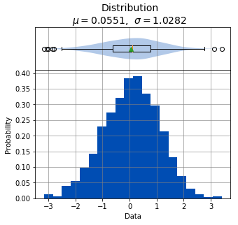
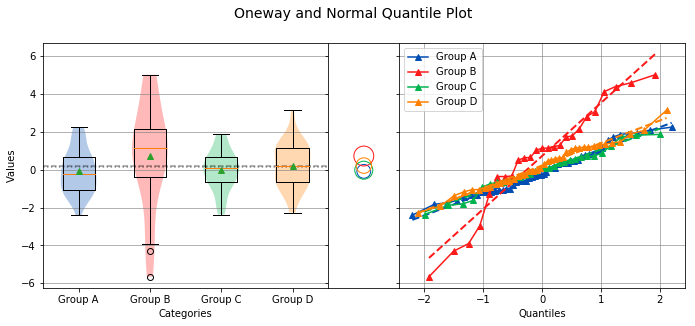

# Using sci-analysis

From the python interpreter or in the first cell of a Jupyter notebook, type:


```python


import numpy as np
import scipy.stats as st
from sci_analysis import analyze
```

This will tell python to import the sci-analysis function ``analyze()``.

.. note:: Alternatively, the function ``analyse()`` can be imported instead, as it is an alias for ``analyze()``. For the case of this documentation, ``analyze()`` will be used for consistency.

If you are using sci-analysis in a Jupyter notebook, you need to use the following code instead to enable inline plots:


```python
%matplotlib inline
import numpy as np
import scipy.stats as st
from sci_analysis import analyze
```

Now, sci-analysis should be ready to use. Try the following code:


```python
np.random.seed(987654321)
data = st.norm.rvs(size=1000)
analyze(xdata=data)
```





    
    
    Statistics
    ----------
    
    n         =  1000
    Mean      =  0.0551
    Std Dev   =  1.0282
    Std Error =  0.0325
    Skewness  = -0.1439
    Kurtosis  = -0.0931
    Maximum   =  3.4087
    75%       =  0.7763
    50%       =  0.0897
    25%       = -0.6324
    Minimum   = -3.1586
    IQR       =  1.4087
    Range     =  6.5673
    
    
    Shapiro-Wilk test for normality
    -------------------------------
    
    alpha   =  0.0500
    W value =  0.9979
    p value =  0.2591
    
    H0: Data is normally distributed
    


A histogram, box plot, summary stats, and test for normality of the data should appear above. 

.. note:: numpy and scipy.stats were only imported for the purpose of the above example. sci-analysis uses numpy and scipy internally, so it isn't necessary to import them unless you want to explicitly use them. 

A histogram and statistics for categorical data can be performed with the following command:


```python
pets = ['dog', 'cat', 'rat', 'cat', 'rabbit', 'dog', 'hamster', 'cat', 'rabbit', 'dog', 'dog']
analyze(pets)
```


    
    
    Overall Statistics
    ------------------
    
    Total            =  11
    Number of Groups =  5
    
    
    Statistics
    ----------
    
    Rank          Frequency     Percent       Category      
    --------------------------------------------------------
    1             4              36.3636      dog           
    2             3              27.2727      cat           
    3             2              18.1818      rabbit        
    4             1              9.0909       hamster       
    4             1              9.0909       rat           


Let's examine the ``analyze()`` function in more detail. Here's the signature for the ``analyze()`` function:


```python
from inspect import signature
print(analyze.__name__, signature(analyze))
print(analyze.__doc__)
```

    analyze (xdata, ydata=None, groups=None, labels=None, alpha=0.05, order=None, dropna=None, **kwargs)
    
        Automatically performs a statistical analysis based on the input arguments.
    
        Parameters
        ----------
        xdata : array-like
            The primary set of data.
        ydata : array-like
            The response or secondary set of data.
        groups : array-like
            The group names used for location testing or Bivariate analysis.
        labels : array-like or None
            The sequence of data point labels.
        alpha : float
            The sensitivity to use for hypothesis tests.
        order : array-like
            The order that categories in sequence should appear.
        dropna : bool
            Remove all occurances of numpy NaN.
    
        Returns
        -------
        xdata, ydata : tuple(array-like, array-like)
            The input xdata and ydata.
    
        Notes
        -----
        xdata : array-like(num), ydata : None --- Distribution
        xdata : array-like(str), ydata : None --- Frequencies
        xdata : array-like(num), ydata : array-like(num) --- Bivariate
        xdata : array-like(num), ydata : array-like(num), groups : array-like --- Group Bivariate
        xdata : list(array-like(num)), ydata : None --- Location Test(unstacked)
        xdata : list(array-like(num)), ydata : None, groups : array-like --- Location Test(unstacked)
        xdata : dict(array-like(num)), ydata : None --- Location Test(unstacked)
        xdata : array-like(num), ydata : None, groups : array-like --- Location Test(stacked)
        


``analyze()`` will detect the desired type of data analysis to perform based on whether the ``ydata`` argument is supplied, and whether the ``xdata`` argument is a two-dimensional array-like object. 

The ``xdata`` and ``ydata`` arguments can accept most python array-like objects, with the exception of strings. For example, ``xdata`` will accept a python list, tuple, numpy array, or a pandas Series object. Internally, iterable objects are converted to a Vector object, which is a pandas Series of type ``float64``.

.. note:: A one-dimensional list, tuple, numpy array, or pandas Series object will all be referred to as a vector throughout the documentation.

If only the ``xdata`` argument is passed and it is a one-dimensional vector of numeric values, the analysis performed will be a histogram of the vector with basic statistics and Shapiro-Wilk normality test. This is useful for visualizing the distribution of the vector. If only the ``xdata`` argument is passed and it is a one-dimensional vector of categorical (string) values, the analysis performed will be a histogram of categories with rank, frequencies and percentages displayed.

If ``xdata`` and ``ydata`` are supplied and are both equal length one-dimensional vectors of numeric data, an x/y scatter plot with line fit will be graphed and the correlation between the two vectors will be calculated. If there are non-numeric or missing values in either vector, they will be ignored. Only values that are numeric in each vector, at the same index will be included in the correlation. For example, the two following two vectors will yield:


```python
example1 = [0.2, 0.25, 0.27, np.nan, 0.32, 0.38, 0.39, np.nan, 0.42, 0.43, 0.47, 0.51, 0.52, 0.56, 0.6]
example2 = [0.23, 0.27, 0.29, np.nan, 0.33, 0.35, 0.39, 0.42, np.nan, 0.46, 0.48, 0.49, np.nan, 0.5, 0.58]
analyze(example1, example2)
```


    
    
    Linear Regression
    -----------------
    
    n         =  11
    Slope     =  0.8467
    Intercept =  0.0601
    r         =  0.9836
    r^2       =  0.9674
    Std Err   =  0.0518
    p value   =  0.0000
    
    
    
    Pearson Correlation Coefficient
    -------------------------------
    
    alpha   =  0.0500
    r value =  0.9836
    p value =  0.0000
    
    HA: There is a significant relationship between predictor and response
    


If ``xdata`` is a sequence or dictionary of vectors, a location test and summary statistics for each vector will be performed. If each vector is normally distributed and they all have equal variance, a one-way ANOVA is performed. If the data is not normally distributed or the vectors do not have equal variance, a non-parametric Kruskal-Wallis test will be performed instead of a one-way ANOVA.

.. note:: Vectors should be independent from one another --- that is to say, there shouldn't be values in one vector that are derived from or some how related to a value in another vector. These dependencies can lead to weird and often unpredictable results. 

A proper use case for a location test would be if you had a table with measurement data for multiple groups, such as test scores per class, average height per country or measurements per trial run, where the classes, countries, and trials are the groups. In this case, each group should be represented by it's own vector, which are then all wrapped in a dictionary or sequence. 

If ``xdata`` is supplied as a dictionary, the keys are the names of the groups and the values are the array-like objects that represent the vectors. Alternatively, ``xdata`` can be a python sequence of the vectors and the ``groups`` argument a list of strings of the group names. The order of the group names should match the order of the vectors passed to ``xdata``. 

.. note:: Passing the data for each group into ``xdata`` as a sequence or dictionary is often referred to as "unstacked" data. With unstacked data, the values for each group are in their own vector. Alternatively, if values are in one vector and group names in another vector of equal length, this format is referred to as "stacked" data. The ``analyze()`` function can handle either stacked or unstacked data depending on which is most convenient.

For example:


```python
np.random.seed(987654321)
group_a = st.norm.rvs(size=50)
group_b = st.norm.rvs(size=25)
group_c = st.norm.rvs(size=30)
group_d = st.norm.rvs(size=40)
analyze({"Group A": group_a, "Group B": group_b, "Group C": group_c, "Group D": group_d})
```


    
    
    Overall Statistics
    ------------------
    
    Number of Groups =  4
    Total            =  145
    Grand Mean       =  0.0598
    Pooled Std Dev   =  1.0992
    Grand Median     =  0.0741
    
    
    Group Statistics
    ----------------
    
    n             Mean          Std Dev       Min           Median        Max           Group         
    --------------------------------------------------------------------------------------------------
    50            -0.0891        1.1473       -2.4036       -0.2490        2.2466       Group A       
    25             0.2403        0.9181       -1.8853        0.3791        1.6715       Group B       
    30            -0.1282        1.0652       -2.4718       -0.0266        1.7617       Group C       
    40             0.2159        1.1629       -2.2678        0.1747        3.1400       Group D       
    
    
    Bartlett Test
    -------------
    
    alpha   =  0.0500
    T value =  1.8588
    p value =  0.6022
    
    H0: Variances are equal
    
    
    
    Oneway ANOVA
    ------------
    
    alpha   =  0.0500
    f value =  1.0813
    p value =  0.3591
    
    H0: Group means are matched
    


In the example above, sci-analysis is telling us the four groups are normally distributed (by use of the Bartlett Test, Oneway ANOVA and the near straight line fit on the quantile plot), the groups have equal variance and the groups have matching means. The only significant difference between the four groups is the sample size we specified. Let's try another example, but this time change the variance of group B:


```python
np.random.seed(987654321)
group_a = st.norm.rvs(0.0, 1, size=50)
group_b = st.norm.rvs(0.0, 3, size=25)
group_c = st.norm.rvs(0.1, 1, size=30)
group_d = st.norm.rvs(0.0, 1, size=40)
analyze({"Group A": group_a, "Group B": group_b, "Group C": group_c, "Group D": group_d})
```





    
    
    Overall Statistics
    ------------------
    
    Number of Groups =  4
    Total            =  145
    Grand Mean       =  0.2049
    Pooled Std Dev   =  1.5350
    Grand Median     =  0.1241
    
    
    Group Statistics
    ----------------
    
    n             Mean          Std Dev       Min           Median        Max           Group         
    --------------------------------------------------------------------------------------------------
    50            -0.0891        1.1473       -2.4036       -0.2490        2.2466       Group A       
    25             0.7209        2.7543       -5.6558        1.1374        5.0146       Group B       
    30            -0.0282        1.0652       -2.3718        0.0734        1.8617       Group C       
    40             0.2159        1.1629       -2.2678        0.1747        3.1400       Group D       
    
    
    Bartlett Test
    -------------
    
    alpha   =  0.0500
    T value =  42.7597
    p value =  0.0000
    
    HA: Variances are not equal
    
    
    
    Kruskal-Wallis
    --------------
    
    alpha   =  0.0500
    h value =  7.1942
    p value =  0.0660
    
    H0: Group means are matched
    


In the example above, group B has a standard deviation of 2.75 compared to the other groups that are approximately 1. The quantile plot on the right also shows group B has a much steeper slope compared to the other groups, implying a larger variance. Also, the Kruskal-Wallis test was used instead of the Oneway ANOVA because the pre-requisite of equal variance was not met.

In another example, let's compare groups that have different distributions and different means:


```python
np.random.seed(987654321)
group_a = st.norm.rvs(0.0, 1, size=50)
group_b = st.norm.rvs(0.0, 3, size=25)
group_c = st.weibull_max.rvs(1.2, size=30)
group_d = st.norm.rvs(0.0, 1, size=40)
analyze({"Group A": group_a, "Group B": group_b, "Group C": group_c, "Group D": group_d})
```


    
    
    Overall Statistics
    ------------------
    
    Number of Groups =  4
    Total            =  145
    Grand Mean       = -0.0694
    Pooled Std Dev   =  1.4903
    Grand Median     = -0.1148
    
    
    Group Statistics
    ----------------
    
    n             Mean          Std Dev       Min           Median        Max           Group         
    --------------------------------------------------------------------------------------------------
    50            -0.0891        1.1473       -2.4036       -0.2490        2.2466       Group A       
    25             0.7209        2.7543       -5.6558        1.1374        5.0146       Group B       
    30            -1.0340        0.8029       -2.7632       -0.7856       -0.0606       Group C       
    40             0.1246        1.1081       -1.9334        0.0193        3.1400       Group D       
    
    
    Levene Test
    -----------
    
    alpha   =  0.0500
    W value =  10.1675
    p value =  0.0000
    
    HA: Variances are not equal
    
    
    
    Kruskal-Wallis
    --------------
    
    alpha   =  0.0500
    h value =  23.8694
    p value =  0.0000
    
    HA: Group means are not matched
    


The above example models group C as a Weibull distribution, while the other groups are normally distributed. You can see the difference in the distributions by the one-sided tail on the group C boxplot, and the curved shape of group C on the quantile plot. Group C also has significantly the lowest mean as indicated by the Tukey-Kramer circles and the Kruskal-Wallis test.
